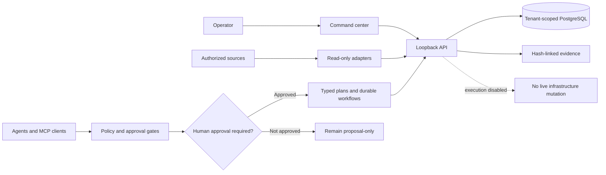
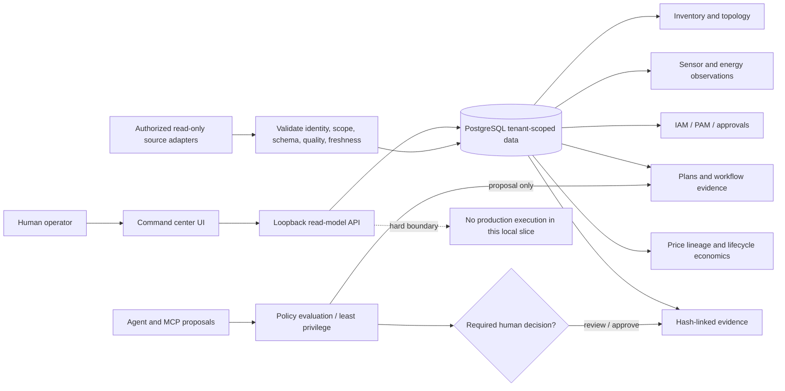
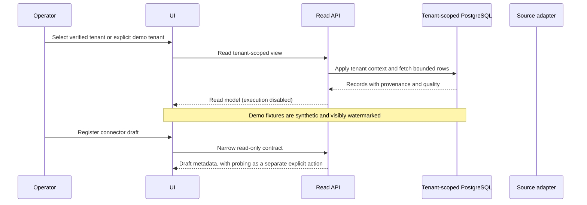
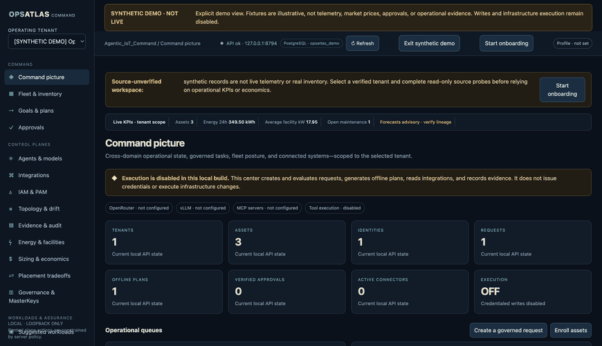

# Agentic_IoT_Command — Agentic Infrastructure Command Center

[](https://github.com/AAH20/agentic-iot-command/actions/workflows/ci.yml)
[](LICENSE)

> A governed command center for infrastructure operations: observe first, plan
> with evidence, require policy and human authorization, and keep execution
> explicitly disabled until independently validated.

**Status:** early-stage source prototype—not production-ready. No worker is
deployed on Ubuntu, and no live infrastructure control is enabled.

## Architecture

The control plane separates proposals, authorization, worker boundaries, and
evidence. The published implementation remains non-executing by default.



**Explore:** [architecture handoff](ARCHITECTURE_HANDOFF.md) ·
[threat model](THREAT_MODEL.md) ·
[local integrations](docs/LOCAL_INTEGRATIONS.md) ·
[VirtualBox demo boundary](docs/VIRTUALBOX_MUTATION_ADAPTER.md)

<details>
<summary>Implementation and security status · reviewed 2026-09-28</summary>

The PostgreSQL schema retains the legacy `opsatlas` namespace for compatibility.

Defensive purple-team lab isolation, telemetry evidence, and read-only connector requirements are documented in [`docs/PURPLE_TEAM_READINESS.md`](docs/PURPLE_TEAM_READINESS.md).

Agentic IoT Command is an open-source design and source prototype for a
governed infrastructure control plane. Its target architecture spans macOS and
Ubuntu hosts, datacenters, virtualization, Kubernetes/OpenShift,
Terraform/OpenTofu, IAM/PAM, agent governance, and public-cloud integrations.
Most provider and execution integrations are design targets, not deployed
features.

The project has two related areas:

1. **Skill supply-chain security:** every third-party agent skill is treated as untrusted input. NVIDIA SkillSpector is used before installation, before upgrades, and in CI. A scan is a gate, not proof of safety; approved skills still run in isolated environments with least privilege.
2. **Infrastructure control plane:** a standards-based system that lets agents observe, plan, obtain explicit authorization, execute through scoped credentials, verify outcomes, and emit replayable evidence.

The source prototype includes the fail-closed ingestion gate,
runtime isolation policy, signed approval contract, read-only inventory,
hash-chained evidence ledger, Ubuntu-hosted goal journal prototype, server-hashed
task plan artifacts, task-bound approval queueing, fenced lease state, pinned-SSH
goal gateway client, typed schemas, architecture boundaries, and a local
deny-by-default policy core with a simulated approval lifecycle. The SSH goal
gateway is not yet installed on the user's Ubuntu host. The source tree now has
one narrow worker coordinator and a VirtualBox demo adapter, but no installed
worker or enabled mutation path. Provider mutation adapters, JIT credential brokers,
isolated mutation runners, and production access remain unavailable until their
independent controls are implemented and validated.

The source prototype also includes a grant-issuance primitive that
revalidates either operator approval or a standing-policy profile plus its
impact assessment against lease state. Execution-grant v2 binds the authorization
mode and evidence digests separately, plus Ed25519 grant and runner-receipt
signing/verification code. A confined Unix-socket signer source now keeps the
private key in a dedicated non-root service identity and pins the initial
signing scope to one tenant, runner, VM target, operation, and short runtime.
It protects the key but trusts the local API to perform authorization checks;
it is not an independent policy engine and is not installed or Linux-validated.
A one-shot worker coordinator now connects a
certificate-scoped mTLS client to the fixed adapter and posts signed runner
evidence to the journal. Runner evidence is not independent postcondition
verification, so it cannot complete a task. A first narrow VirtualBox demo-metadata mutation
adapter now exists as a worker boundary: it accepts only a fixed UUID-scoped
plan and fixed `VBoxManage modifyvm --description` operation, performs exact
precondition/postcondition checks, and requires fresh grant preflight, a worker
kill switch, and an authenticated one-shot permit-consumer interface. A
certificate-scoped mTLS server/client API now backs those interfaces in source,
but no long-running worker service or worker-identity registry service
integration is installed. A signed, audited late-receipt reconciliation route
now exists in source but has not been exercised over Linux mTLS. Source-level independent
postcondition signing, read-only VirtualBox observation, and journal-side
verification are now implemented, along with a verifier-only mTLS API for
candidate reads and signed-result submission. They are not deployed as a
separate observer service. The verifier API's strict root-managed identity
registry is wired into its prepared service entrypoint and Ubuntu installer;
that API service is not installed or Linux-verified. The runner identity
registry is not yet wired into a worker service. The receipt outbox exists in
source but is not configured on Ubuntu.
The handoff is therefore a source prototype, not yet the requested live
control plane. In particular, it is not installed on Ubuntu, has no deployed
runner/API service, cannot currently perform even the demo mutation, and has no
cloud/datacenter adapters. The first live milestone remains read-only Ubuntu
and VirtualBox inventory over pinned SSH; only after that is observed should
the operator enroll a disposable VM for the gated mutation canary.

The local API now exposes `/readyz` separately from process liveness. It returns
ready only when PostgreSQL, the required core schema, and forced tenant RLS are
present; in-memory demos intentionally remain not-ready for a persistent pilot.
This endpoint does not add user authentication or authorize remote exposure.

Hermes swarm orchestration, an OpenRouter-like model gateway, and Computer Use
are architecture extensions only: none is installed, connected, or authorized
for live operations. Their trust boundaries, IAM/PAM contract, deployment
gates, and declarative agent-profile schema are documented in
[`docs/HERMES_SWARM_GOVERNANCE.md`](./docs/HERMES_SWARM_GOVERNANCE.md).

Tests use fake transports and an injected VirtualBox command runner without
invoking VirtualBox. See
[`docs/VIRTUALBOX_MUTATION_ADAPTER.md`](./docs/VIRTUALBOX_MUTATION_ADAPTER.md).
The mTLS transport and endpoint boundaries are documented in
[`docs/WORKER_MTLS_API.md`](./docs/WORKER_MTLS_API.md).
Grant claims are derived from trusted live lease context by the runner
preflight; caller-supplied expected claims are not authority. Grant
issuance also requires a root-managed, short-lived execution enablement file;
the installer ships it disabled by default. Runner-side kill-switch enforcement
is wired into the adapter boundary but has not been exercised on an installed
worker. The
journal opens a durable target/operation circuit breaker
on signed failure/unknown receipts or unexpected credential issuance; a fresh
single-use approval bound to an evidence digest is required to reset it. The
worker-side breaker gate remains unimplemented.

</details>

Run the local core checks with:

```bash
./scripts/validate-policies.sh
PYTHONPATH=src python3 -m unittest discover -s tests/unit -v
```

## Documentation

Start with the [architecture and implementation handoff](ARCHITECTURE_HANDOFF.md),
[energy-to-compute operations](docs/ENERGY_TO_COMPUTE_OPERATIONS.md),
[local integrations](docs/LOCAL_INTEGRATIONS.md),
[database and analytics](docs/DATABASE_AND_ANALYTICS.md), and
[security threat model](THREAT_MODEL.md).

<details>
<summary>Full document and source index</summary>

- [`SKILL_INGESTION_SECURITY.md`](./SKILL_INGESTION_SECURITY.md) — SkillSpector-centered ingestion, hooks, scanning, verdicts, quarantine, and runtime controls.
- [`ARCHITECTURE_HANDOFF.md`](./ARCHITECTURE_HANDOFF.md) — complete system architecture and implementation plan.
- [`docs/HERMES_SWARM_GOVERNANCE.md`](./docs/HERMES_SWARM_GOVERNANCE.md) — Hermes-style swarm, skill trust, model routing, IAM/PAM, Computer Use isolation, adoption metrics, and rollout gates.
- [`docs/COMMAND_CENTER_PROJECT_STRUCTURE.md`](./docs/COMMAND_CENTER_PROJECT_STRUCTURE.md) — target project tree, federated command-center/runtime boundaries, canonical evidence model, and staged implementation path.
- [`docs/OPSATLAS_ARCHITECTURE.md`](./docs/OPSATLAS_ARCHITECTURE.md) — Agentic_IoT_Command OSS charter, Mermaid architectures, sensor fusion, contracts, integrations, trust boundaries, and commercial layers.
- [`docs/ENERGY_TO_COMPUTE_OPERATIONS.md`](./docs/ENERGY_TO_COMPUTE_OPERATIONS.md) — energy-to-compute model, full data-center operating workflows, SOP controls, KPIs, governance classes, and rollout gates.
- [`docs/OPSATLAS_UI_UX_AND_COMMERCIAL_BOUNDARIES.md`](./docs/OPSATLAS_UI_UX_AND_COMMERCIAL_BOUNDARIES.md) — modular UI architecture, operator information architecture, MasterKeys/key custody, OSS/commercial boundaries, agent-runtime and MCP governance, OpenRouter/vLLM model routing, a versioned cloud/IoT/OEM API connector portfolio, entitlement enforcement, and product acceptance tests.
- [`docs/LOCAL_INTEGRATIONS.md`](./docs/LOCAL_INTEGRATIONS.md) — runnable loopback console, real read-only OpenRouter/vLLM catalog calls, and MCP Streamable HTTP discovery/tools-list with legacy fallback; lists required local configuration and current connector limits.
- [`schemas/swarm-agent-profile.schema.json`](./schemas/swarm-agent-profile.schema.json) — declarative constraints for skills, tools, model route, classification, target scope, delegation, budgets, and Computer Use; grants no authority on its own.
- [`THREAT_MODEL.md`](./THREAT_MODEL.md) — attacker model, trust boundaries, abuse cases, and mitigations.
- [`AGENT_BOOTSTRAP.md`](./AGENT_BOOTSTRAP.md) — first-session instructions for the fresh Codex agent.
- [`policies/skill-gate.json`](./policies/skill-gate.json) — machine-readable installation policy.
- [`policies/runtime-defaults.json`](./policies/runtime-defaults.json) — deny-by-default runtime isolation profiles.
- [`schemas/skill-approval.schema.json`](./schemas/skill-approval.schema.json) — approval-ledger contract.
- [`schemas/infrastructure-task-plan.schema.json`](./schemas/infrastructure-task-plan.schema.json) — strict typed plan artifact bound to task identity, target set, environment, preconditions, desired state, rollback strategy, and runtime limit.
- [`schemas/execution-grant.schema.json`](./schemas/execution-grant.schema.json) — short-lived one-runner capability bound to one task, target, operation, plan, lease generation, and lease-token digest; v2 distinguishes operator approval from standing-policy authorization and binds policy/impact digests without inventing an approval ID.
- [`schemas/postcondition-verifier-registry.schema.json`](./schemas/postcondition-verifier-registry.schema.json) and [`config/postcondition-verifiers.example.json`](./config/postcondition-verifiers.example.json) — strict verifier certificate/scope registry contract and non-deployable example.
- [`schemas/impact-assessment.schema.json`](./schemas/impact-assessment.schema.json) — short-lived Ed25519-signed cost and affected-resource assessment bound to an exact task, target set, operation, environment, and plan digest.
- [`schemas/evidence-envelope.schema.json`](./schemas/evidence-envelope.schema.json) and [`schemas/local-inventory.schema.json`](./schemas/local-inventory.schema.json) — first read-only evidence contracts.
- [`schemas/ledger-record.schema.json`](./schemas/ledger-record.schema.json) — hash-chained ledger record contract.
- [`scripts/scan-skill.sh`](./scripts/scan-skill.sh) — fail-closed scanner wrapper.
- [`scripts/install-skill-gated.sh`](./scripts/install-skill-gated.sh) — scan, pin, quarantine, and approval-gated install wrapper. It never installs without an externally verified, digest-bound approval record and pinned local binaries.
- [`scripts/verify-approval.sh`](./scripts/verify-approval.sh) — Ed25519 verifier backed by an operator-configured public-key trust directory.
- [`scripts/verify-execution-grant.sh`](./scripts/verify-execution-grant.sh) — root-trust-store-backed Ed25519 verifier for bounded runner grants; it does not issue grants or execute actions.
- [`scripts/validate-policies.sh`](./scripts/validate-policies.sh) — policy baseline validation.
- [`scripts/inventory-local.sh`](./scripts/inventory-local.sh) — credential-free, no-network local inventory collector.
- [`scripts/evidence-ledger.py`](./scripts/evidence-ledger.py) — append-only, tenant-chained evidence ledger; the local API can persist to the same JSONL format with `A2Z_EVIDENCE_LEDGER_PATH`.
- [`schemas/execution-receipt.json`](./schemas/execution-receipt.json) and [`schemas/verification-result.json`](./schemas/verification-result.json) — controlled-lifecycle receipts.
- [`docs/GRAPH_DRIFT_VERIFICATION.md`](./docs/GRAPH_DRIFT_VERIFICATION.md) — tenant-scoped graph, deterministic drift, and simulation-safe verification boundary.
- [`docs/REMOTE_ACCESS_OPTIONS.md`](./docs/REMOTE_ACCESS_OPTIONS.md) — opt-in live read-only SSH inventory and human-supervised RustDesk path; mutation remains gated/disabled.
- [`docs/VIRTUALBOX_FIRST_DEMO.md`](./docs/VIRTUALBOX_FIRST_DEMO.md) — operator runbook for demonstrating the control plane against Ubuntu-hosted VirtualBox VMs before adding other platforms.
- [`docs/CODEX_UBUNTU_VIRTUALBOX_ONBOARDING.md`](./docs/CODEX_UBUNTU_VIRTUALBOX_ONBOARDING.md) — exact Linux/Mac steps to enroll the host and connect Codex through read-only, approval-prompted inventory, operator-baseline drift comparison, and evidence-verification MCP tools.
- [`docs/AUTONOMY_CONTROL_MODEL.md`](./docs/AUTONOMY_CONTROL_MODEL.md) — policy model for user-governed routine autonomy, critical approvals, fleet execution controls, and current implementation gaps.
- [`docs/GOAL_JOURNAL.md`](./docs/GOAL_JOURNAL.md) — Ubuntu-hosted durable goal/task journal, idempotent goal records, hash-linked events, and explicit no-execution boundary.
- [`docs/GOAL_MCP_SETUP.md`](./docs/GOAL_MCP_SETUP.md) — Ubuntu gateway installation and exact macOS steps to expose goal submission, typed task proposals, signed-policy evaluation, and status to Codex over pinned SSH.
- [`docs/SIGNED_AUTONOMY_POLICY.md`](./docs/SIGNED_AUTONOMY_POLICY.md) — signed standing-policy envelope, public-key trust configuration, expiry, revocation, and fail-closed verification.
- [`docs/IMPACT_ASSESSMENTS.md`](./docs/IMPACT_ASSESSMENTS.md) — signed, short-lived, plan-bound cost/blast-radius evidence and estimator trust requirements.
- [`src/control_plane_core/goals.py`](./src/control_plane_core/goals.py) — SQLite goal/task journal with hash-linked events, fenced leases, task-bound signed approvals, and standing-policy revalidation at lease claim, grant issuance, and one-shot permit consumption; it cannot execute actions itself.
- [`src/control_plane_core/execution_grants.py`](./src/control_plane_core/execution_grants.py) — short-lived execution-grant signing and exact-claim verification primitives. The direct root-owned-key signer is not usable by the unprivileged API; the dedicated signer service above is the confined source-level alternative and is not yet deployed.
- [`src/control_plane_core/grant_signer_service.py`](./src/control_plane_core/grant_signer_service.py), [`deploy/systemd/a2z-grant-signer.service`](./deploy/systemd/a2z-grant-signer.service), and [`scripts/install-grant-signer-linux.sh`](./scripts/install-grant-signer-linux.sh) — systemd-activated local signing boundary, Linux peer-UID check, exact one-target/one-operation policy, and a staged Ubuntu installer. Not installed or Linux-validated; the API process remains trusted to validate approvals/policies.
- [`docs/GRANT_SIGNER_SERVICE.md`](./docs/GRANT_SIGNER_SERVICE.md), [`config/grant-signer.example.json`](./config/grant-signer.example.json), and [`schemas/grant-signer-config.schema.json`](./schemas/grant-signer-config.schema.json) — signer threat boundary and strict first-canary configuration contract.
- [`src/control_plane_core/virtualbox_adapter.py`](./src/control_plane_core/virtualbox_adapter.py) — one narrow VirtualBox lab mutation boundary; requires fresh signed preflight, worker kill switch, and one-shot permit consumer, none of which are yet connected to a live Ubuntu worker.
- [`src/control_plane_core/worker_service.py`](./src/control_plane_core/worker_service.py) — one-task coordinator for ready poll, authenticated lease/grant flow, the fixed VirtualBox adapter, and signed evidence submission; it does not independently verify postconditions or mark tasks complete.
- [`src/control_plane_core/worker_api.py`](./src/control_plane_core/worker_api.py), [`src/control_plane_core/worker_api_service.py`](./src/control_plane_core/worker_api_service.py), and [`src/control_plane_core/worker_api_registry.py`](./src/control_plane_core/worker_api_registry.py) — certificate-scoped mTLS API, strict certificate registry, configuration/trust validation, and service assembly. They are source only and not Linux-validated.
- [`scripts/worker-api-server.py`](./scripts/worker-api-server.py), [`scripts/install-worker-api-linux.sh`](./scripts/install-worker-api-linux.sh), and [`deploy/systemd/a2z-worker-api.service`](./deploy/systemd/a2z-worker-api.service) — staged worker API entrypoint, stopped-file installer, and loopback-only hardened service. Not installed; see [`docs/WORKER_API_SERVICE_DEPLOYMENT.md`](./docs/WORKER_API_SERVICE_DEPLOYMENT.md).
- [`src/control_plane_core/postcondition_observer.py`](./src/control_plane_core/postcondition_observer.py) and [`src/control_plane_core/postcondition_attestations.py`](./src/control_plane_core/postcondition_attestations.py) — fixed read-only VirtualBox observation and separate-key signed postcondition evidence; separate-service deployment remains outstanding.
- [`src/control_plane_core/postcondition_api.py`](./src/control_plane_core/postcondition_api.py) — separate mTLS identity registry and narrowly scoped verifier API; it cannot claim runner tasks or execute commands.
- [`src/control_plane_core/postcondition_outbox.py`](./src/control_plane_core/postcondition_outbox.py) — owner-only durable spool for exact signed verifier evidence across response loss and process restart.
- [`src/control_plane_core/postcondition_registry.py`](./src/control_plane_core/postcondition_registry.py) — fail-closed root-managed verifier registry loader; no default identities or wildcard scope.
- [`docs/POSTCONDITION_VERIFICATION.md`](./docs/POSTCONDITION_VERIFICATION.md) — source implementation and deployment boundary for independent postcondition verification.
- [`docs/POSTCONDITION_SERVICE_DEPLOYMENT.md`](./docs/POSTCONDITION_SERVICE_DEPLOYMENT.md) — Ubuntu 26.04 manual configuration and staged start procedure for the verifier-only journal API; observer/worker remain separate.
- [`src/control_plane_core/receipt_outbox.py`](./src/control_plane_core/receipt_outbox.py) — owner-only durable receipt spool that retries identical signed evidence and blocks new mutations while records are pending.
- [`src/control_plane_core/execution_controls.py`](./src/control_plane_core/execution_controls.py) — root-managed, fail-closed execution kill switch checked at grant issuance.
- [`src/control_plane_core/impact_assessments.py`](./src/control_plane_core/impact_assessments.py) — strict verifier for fresh, exact-plan signed cost/blast-radius estimates from separately trusted assessors.
- [`scripts/verify-impact-assessment.sh`](./scripts/verify-impact-assessment.sh) — fixed-system-OpenSSL verifier for the root-trusted impact-assessment key directory.
- [`scripts/mcp_goal_journal.py`](./scripts/mcp_goal_journal.py) — Ubuntu stdio MCP gateway for goal/task policy operations and signed task approval queueing; no infrastructure executor.
- [`scripts/mcp_goal_journal_client.py`](./scripts/mcp_goal_journal_client.py) — macOS Codex stdio bridge using pinned SSH and a fixed forced-command gateway.
- [`scripts/install-goal-gateway-linux.sh`](./scripts/install-goal-gateway-linux.sh) — fail-closed installer for reviewed root-owned gateway files; it does not create SSH keys, edit sshd, or install a worker.
- [`src/control_plane_core/autonomy_profiles.py`](./src/control_plane_core/autonomy_profiles.py) — strict profile parsing and domain-separated Ed25519 verification.
- [`src/control_plane_core/autonomy_catalog.py`](./src/control_plane_core/autonomy_catalog.py) — code-owned risk classification and exact typed-plan validation for VirtualBox lifecycle and fixed demo-metadata actions.
- [`src/control_plane_core/evidence.py`](./src/control_plane_core/evidence.py) — tenant-partitioned evidence hash chain with optional owner-only JSONL persistence; PostgreSQL API records use the same canonical record format.
- [`docs/CONTROLLED_CHANGE_SERVICE.md`](./docs/CONTROLLED_CHANGE_SERVICE.md) — signed approval binding and end-to-end simulated change workflow.
- [`docs/LOCAL_API.md`](./docs/LOCAL_API.md) — loopback-only Phase 1 service facade.
- [`docs/DATABASE_AND_ANALYTICS.md`](./docs/DATABASE_AND_ANALYTICS.md) — PostgreSQL/Supabase schema, tenant RLS, guarded synthetic seed/reset, database-backed UI paths, analytics model, and demo-only pgbench protocol.
- [`database/schema.sql`](./database/schema.sql) — portable normalized PostgreSQL core for fleet, IAM/PAM, workflows, integrations, MCP, sensor/energy, maintenance, KPI, forecasts, evidence, and benchmarks.
- [`database/demo_seed.sql`](./database/demo_seed.sql) — deterministic synthetic data; demo-only labels and no fake signatures or real provider credentials.
- [`src/control_plane_core/connectors.py`](./src/control_plane_core/connectors.py) and [`src/control_plane_core/plan.py`](./src/control_plane_core/plan.py) — read-only connector registry and offline plan evaluation.
- [`src/control_plane_core/runner.py`](./src/control_plane_core/runner.py) — capability-token, credential-broker, and runner-dispatch boundaries.
- [`src/control_plane_core/agents.py`](./src/control_plane_core/agents.py) — agent manifests, tool registry, supervisor routing, and tool-call gateway.
- [`src/control_plane_core/iam.py`](./src/control_plane_core/iam.py) — workload identity, session, and break-glass boundaries.
- [`.github/workflows/skill-scan.yml`](./.github/workflows/skill-scan.yml) — CI hook for skill changes.

</details>

## Non-goals

This project does not provide a path into classified networks, bypass authorization, collect intelligence, or create hidden access. Any government or classified deployment requires the relevant sponsor, security authority, facility, personnel, export, privacy, and accreditation processes.

## Local synthetic walkthrough

For an explicitly labeled walkthrough of the seeded PostgreSQL tenant, append
`?tenant_id=00000000-0000-4000-8000-000000000001&demo=synthetic` to the local
URL (for example `http://127.0.0.1:8794/?tenant_id=00000000-0000-4000-8000-000000000001&demo=synthetic`).
Without `demo=synthetic`, synthetic KPI and price results remain quarantined.
The demo switch is presentation-only; it does not create live source status,
make connector probes, authorize tools, create genuine approvals, or enable
execution. Every fixture is an illustrative scenario, not real telemetry,
market pricing, an audit artifact, or operational evidence.

The repository's canonical seed is [`database/demo_seed.sql`](database/demo_seed.sql);
[`database/demo_recent_history.sql`](database/demo_recent_history.sql) adds a
rolling 24-hour fixture series when a recently populated demo view is needed;
cost fixtures are separately gated by [`database/demo_cost_seed.sql`](database/demo_cost_seed.sql).
Apply the history extension only to the local demo database with
`psql "$A2Z_DATABASE_URL" -v ON_ERROR_STOP=1 -f database/demo_recent_history.sql`.
Use only the specifically named local demo database described in
[`docs/DATABASE_AND_ANALYTICS.md`](docs/DATABASE_AND_ANALYTICS.md). Never point
seed/reset scripts at a production or shared database.

## Detailed request and data flows





## Roadmap

| Stage | Scope | Exit evidence |
|---|---|---|
| 0 · Local demonstrator | Tenant-scoped schema, source-unverified UI, explicit synthetic walkthrough, read-only API | Seed/reset boundary tests, schema and policy tests pass; synthetic screenshot gallery and GIF committed |
| 1 · Trustworthy source onboarding | Connector contract, secret-reference boundary, read-only probe, schema/unit/quality/freshness validation | Adapter contract tests, redacted diagnostic evidence, operator-reviewed tenant mapping |
| 2 · Decision-quality analytics | Lineage-complete KPIs, data-quality SLOs, robust baselines, failure labels, reproducible model evaluations | Backtests, calibration/error reports, drift controls, human review; no forecast on insufficient/non-authoritative data |
| 3 · Operational integrations | Versioned vendor/cloud/facility read adapters and durable workflow references | Vendor-specific sandbox tests, least privilege, rate-limit and stale-data behavior, rollback/runbook |
| 4 · Multi-tenant production | AuthN/AuthZ, managed secrets, tenant isolation tests, migrations, backups, observability, incident response | Independent security review, recovery exercise, SLOs, privacy and data-retention approvals |
| 5 · Optional commercial services | Hosted control plane, enterprise identity, connector certification, fleet analytics and support | OSS/commercial boundary documented; customer-controlled credentials, export and exit tested |

Stages are sequencing, not a claim that production readiness or live adapters
are already achieved. Detailed implementation status and gaps are described in
the architecture, integration, security, and local-development documents.

### Screenshots and GIF

The local walkthrough is available at
`http://127.0.0.1:8794/?tenant_id=00000000-0000-4000-8000-000000000001&demo=synthetic`.
These captures show that explicit synthetic tenant only. The visible watermark
is preserved in every frame; the fixtures are illustrative, not live telemetry,
inventory, prices, approvals, or operational evidence. Integrations are not
connected, and infrastructure execution remains disabled.



<details>
<summary>Browse focused screens</summary>

| Area | Screenshot |
|---|---|
| Command picture | [command-picture.png](docs/media/command-picture.png) |
| Fleet & inventory | [fleet-inventory.png](docs/media/fleet-inventory.png) |
| Goals & plans | [goals-plans.png](docs/media/goals-plans.png) |
| Approvals | [approvals.png](docs/media/approvals.png) |
| Agents & models | [agents-models.png](docs/media/agents-models.png) |
| Integrations | [integrations.png](docs/media/integrations.png) |
| IAM & PAM | [iam-pam.png](docs/media/iam-pam.png) |
| Topology & drift | [topology-drift.png](docs/media/topology-drift.png) |
| Evidence & audit | [evidence-audit.png](docs/media/evidence-audit.png) |
| Energy & facilities | [energy-facilities.png](docs/media/energy-facilities.png) |
| Sizing & economics | [sizing-economics.png](docs/media/sizing-economics.png) |
| Placement tradeoffs | [placement-tradeoffs.png](docs/media/placement-tradeoffs.png) |
| Governance & MasterKeys | [governance-masterkeys.png](docs/media/governance-masterkeys.png) |
| Suggested workloads | [suggested-workloads.png](docs/media/suggested-workloads.png) |
| Critical & GRC | [critical-grc.png](docs/media/critical-grc.png) |

</details>

## License

This project is licensed under the GNU Affero General Public License v3.0
(AGPL-3.0-only); see [LICENSE](LICENSE).
