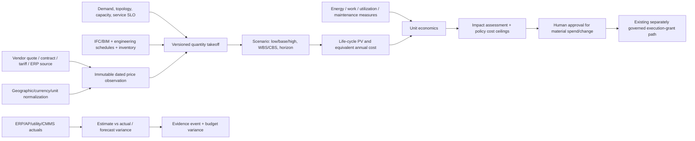

# Cost intelligence for Agentic_IoT_Command

This additive module aligns lifecycle planning and operating economics with the
control plane's existing tenant scope, signed approvals, impact assessment, and
evidence model. A cost estimate informs a decision; it is not authorization to
execute it.

## Structured sizing and source pricing

The additive migration creates `estimate_scenarios`, `estimate_line_items`,
`price_observations`, `cost_books`, `cost_actuals`, and `cost_allocations`, all
tenant-scoped and RLS-protected. Scenarios pin scope, lifecycle phase, version,
currency, geography, price-as-of date, horizon, capacity, area, rack count,
annual energy, useful work, discount rate, contingency and formula version.
Takeoff lines pin quantity/unit, waste, low/base/high rate, price observation,
optional asset/IFC GlobalId, WBS/CBS classification, recurrence, escalation and
useful life. Unpriced lines remain unpriced. IFC/BIM can contribute geometry,
element IDs and classifications, but does not replace approved engineering
quantities, site surveys, procurement quotes, tariff schedules or actual meters.

Price observations retain manufacturer/model/SKU, geography, exact unit/currency,
delivery terms, observed and effective dates, FX basis, source type/name/reference,
source digest, confidence, review state and provenance. Sources may be authorized
vendor APIs, vendor/contract quotes, utility tariff and invoice feeds, approved
benchmark sources, or reviewed manual observations. Dated, normalized conversions
are required before comparison. Never replace history in place or silently use a
stale rate from another region. The schema is ready for ingestion; current
provider catalog entries do not imply active procurement or price-feed adapters.

## Cost accounting and economics

Model CAPEX/OPEX and lifecycle phase separately: site/land, design, civil,
utility connection, electrical/mechanical, compute/network, software, installation,
commissioning, energy/demand charges, water, carbon, service/labor, maintenance,
spares, tax, financing, refresh, residual and decommissioning. Accounting policy
controls capitalization, accruals and depreciation; the application records the
basis rather than deciding statutory treatment. Contingency, inflation/escalation,
FX, tax and discount assumptions are named and versioned.

`estimate_cost_rollup` computes low/base/high discounted lifecycle cash flows,
including recurring lines, recurrence start month, escalation, and horizon.
`cost_actuals` retains period, account, source system, invoice digest, lifecycle
phase, asset/facility, currency and accrual state. `cost_allocations` assigns
shared actuals to a workload using an explicit versioned method and evidence.
Keep unmatched, unallocated and variance values visible; do not force-reconcile
when the accounting periods or scopes differ.

Equivalent annual lifecycle cost is `PV/n` when rate is zero, or
`PV × r / (1 - (1+r)^(-n))` for annual rate `r` over `n` years. Normalize by
matched IT kW-year, rack-year, floor-area-year, facility/IT kWh and verified useful
work (job, request, transaction, token, etc.). Report service/SLO tier and energy
boundary with the denominator. Missing or zero denominators are unknown, not
zero-cost. Low/base/high are bounded scenarios, not confidence intervals unless
the estimate explicitly models probability.

## Governance and system behavior

The UI read path is `/v1/analytics/costs?tenant_id=…`, linked from the command
center navigation. It returns price lineage, scenario PV, unpriced/synthetic
counts and actual-cost periods. The server response is tenant-scoped and read-only.
The migration is additive and intentionally not auto-run against an existing
database; apply it using the local-development database owner after backup and
review. It grants no connector or write permissions.

Cost totals can be passed into the existing impact assessment as sourced
micro-USD estimates with explicit source ID and expiration; policy cost ceilings
remain fail-closed if the source is stale, incomplete, mismatched or absent.
Material procurement, budget moves, production changes and cloud spend actions
must continue through independent approval, signed plan binding, one-shot
execution grant, isolated runner and postcondition verification. The agent must
not quote its own unverified rate as a trusted impact assessment.

## Acquisition integration boundary

For each utility, OEM, cloud billing API or ERP/AP/CMMS system, register a
read-only connection with allow-listed hosts, scoped credentials held in a secret
manager, vendor API/version, rate budget and tested capability. Normalize the
source row into the canonical observation while preserving the raw source digest;
quarantine unknown SKU/unit/tax/discount mappings and require a named reviewer to
approve rates before an estimate can pin them. Use official or contract-authorized
sources—no prohibited scraping. Adapter implementation and credential provisioning
remain deployment work; empty source configuration must not manufacture prices.
