# Agentic_IoT_Command: Energy-to-Compute and Data-Center Operations

## Purpose and operating promise

Agentic_IoT_Command is the operator-facing product name; validate
trademark, domain, and repository availability before public adoption. It is a
vendor-neutral operations and evidence layer for connecting facility energy,
data-center infrastructure, compute platforms, workloads, and governance.
It complements—not replaces—BMS/EPMS, electrical protection, DCIM, CMMS,
ITSM, EMS/DERMS, cloud control planes, and specialist safety systems.

The goal is not a universal control console. It is an auditable operating loop:

> Establish safe capacity → understand energy and compute demand → allocate
> work within electrical, thermal, water, service, and policy envelopes →
> measure the delivered result → learn from verified evidence.

“Energy-to-compute” means traceable, time-aligned accounting from a defined
energy boundary through facility overhead and IT equipment to useful compute
service. It does **not** mean that a single PUE number proves useful work,
carbon impact, resilience, or safety. Report the boundary, interval, meter
quality, allocation method, and uncertainty with every metric.

The design target is globally repeatable integration and operations quality,
not an unsupported claim that one software product can outperform every
integrator at every site. Differentiation comes from open contracts,
conformance-tested adapters, reusable procedures, measured outcomes, and
deployment portability across facility sizes and vendors.

## Operating domains and authority

| Domain | Examples of authoritative systems | Agentic_IoT_Command role | Authority that remains elsewhere |
|---|---|---|---|
| Utility and energy supply | Utility meters, tariffs, market/carbon feeds, microgrid/DERMS | Ingest meter, interval, cost, forecast, emissions and availability evidence | Utility protection, market dispatch, interconnection and DER controls |
| Electrical power train | EPMS, UPS, PDU/RPP, breaker monitoring, generator controllers | Map one-lines to measured capacity, alarms, maintenance state and IT load | Protection relays, breaker trips, transfer switching and generator safety |
| Facilities and environment | BMS, chiller/CRAH/CRAC, CDU, leak detection, water meters, fire systems | Contextual monitoring, alarm correlation, safe operating envelope visibility | BMS sequences, fire/life safety, emergency shutdown and closed-loop control |
| Space and physical assets | DCIM, CMMS/EAM, access control, rack sensors | Reconcile sites, rooms, rows, racks, assets, work orders and access events | Work authorization, lockout/tagout, access policy and CMMS work-order authority |
| IT and virtualization | Hypervisors, Kubernetes, schedulers, cloud APIs, NetBox/CMDB | Inventory, workload-to-host mapping, demand/capacity, approved workload proposals | Platform admission/scheduling and application SLO ownership |
| Service and business demand | ITSM, service catalog, batch queues, job schedulers, SLAs | Relate jobs/services to compute, energy, cost and criticality | Business priority, maintenance windows and customer-impact acceptance |
| Identity, change and evidence | IdP, PAM, ITSM change, policy engine, evidence ledger | Join identities, approvals, exact-scope grants and verified outcomes | Identity provider, PAM, human approval and independent audit authority |

An integration contract declares its data owner, source-of-truth fields,
read/write capability, credential scope, network direction, version, rate
limits, quality semantics, and failure behavior. Initial facility and energy
connectors are read-only. No connector gains command rights by being displayed
in the dashboard or by publishing a “desired state.”

## Energy-to-compute model

```mermaid
flowchart LR
  GRID[Grid, contracts, tariffs, emissions] --> METER[Revenue and interval meters]
  DER[On-site generation, storage, microgrid] --> EPMS[Electrical power train / EPMS]
  GRID --> EPMS
  EPMS --> UPS[UPS, switchgear, generators, transfer paths]
  UPS --> PDU[Busway, RPP, rack PDU, branch circuits]
  PDU --> IT[Servers, accelerators, storage, network]
  IT --> WORK[VMs, containers, jobs, services]
  IT --> HEAT[Heat rejection]
  HEAT --> COOL[CDU, pumps, chillers, CRAH/CRAC, towers]
  WATER[Water source, treatment, discharge] --> COOL
  COOL --> METRICS[Time-aligned energy, thermal, water, cost, carbon]
  METER --> METRICS
  WORK --> METRICS
  METRICS --> ACCOUNT[Measured compute outcomes and allocation]
  ACCOUNT --> PLAN[Capacity / placement / efficiency proposals]
  PLAN --> POLICY[Service, safety, tenant, carbon, cost and approval gates]
  POLICY --> HUMAN[Authorized platform scheduler or named operator]
  HUMAN --> WORK
```

The graph must represent physical and logical paths, not just a flat asset
inventory: utility feed → switchgear → UPS path → distribution segment → rack
PDU → IT device → virtualization/container host → workload/service. Model
redundant paths, shared capacity pools, transfer dependencies, and common-mode
failure domains explicitly. A nominal rating is not available capacity: retain
design, commissioned, derated, reserved, measured, and currently usable values
as distinct, time-stamped facts with source and confidence.

### Canonical energy and service facts

Every interval record should carry tenant/site/region, meter and boundary IDs,
start/end, unit, measured or estimated status, source, calibration/accuracy,
quality, missing-data handling, time-zone/clock quality, and provenance.
Preserve raw readings and vendor semantics beside normalized units. Support
active energy (kWh), instantaneous/interval demand (kW), apparent power (kVA),
power factor, voltage/current, frequency, temperature, humidity/dew point,
pressure, flow, water volume, coolant supply/return temperatures, emissions
intensity, tariff, and compute-service counters where available.

Link service output to resource use with explicit allocation tiers:

1. **Directly metered:** workload or dedicated rack/branch meter, with meter
   boundary and interval match.
2. **Measured host allocation:** host or rack energy apportioned using sampled
   device power and workload utilization, keeping idle/base allocation visible.
3. **Model-estimated:** documented model version, inputs, calibration window,
   error range, and confidence. Never present estimates as meter readings.
4. **Unallocated:** facility energy remains at its measured boundary; do not
   force a precise per-service number where evidence does not support it.

### Metrics and guardrails

| Metric | Definition / usage | Required qualification |
|---|---|---|
| Facility energy | kWh by meter boundary and interval | Meter coverage, loss boundaries, missing intervals |
| IT energy | kWh at agreed IT boundary | Define whether network/storage and support IT are included |
| PUE | total facility energy ÷ IT equipment energy over the same period | Boundary, period, meter grade/coverage; do not compare unlike sites |
| Compute energy intensity | kWh per useful, named service unit (e.g., completed job, inference token class, transaction) | Work definition, quality/SLO, accelerator type, allocation and idle treatment |
| Carbon intensity / emissions | Energy × location/time-specific emissions factor; distinguish market- and location-based accounting as applicable | Source/provider, geography, interval, data timestamp, estimates and accounting method |
| Energy cost | Metered or allocated energy × tariff components | Contract, demand charges, taxes, currency and settlement period |
| Water use / intensity | Water withdrawn/consumed per defined facility or IT/output boundary | Source, cooling method, reporting boundary and local scarcity context |
| Capacity headroom | Safe usable capacity minus committed/forecast demand | Redundancy state, ambient conditions, maintenance reserve and contingency |
| Thermal margin | Distance from the stricter applicable equipment/site operating limit | Sensor location, calibration, transient allowance and approved envelope |
| Availability and resilience | Service availability, redundancy, recovery and test outcomes | SLO, test window, exclusions, common-mode dependencies |

Never optimize PUE, carbon, water, cost, utilization, or compute throughput in
isolation. A proposal must state its objective and constraints. Lowest-carbon
time or region is not automatically eligible if it violates data residency,
latency, capacity, reliability, security, cost, or customer commitments.

## Operations-center experience

The primary views are: global/site situation board; electrical one-line and
capacity; cooling/thermal and water; asset topology; compute/workload demand;
energy/carbon/cost; incidents; maintenance and change calendar; capacity
planning; procedures/evidence; and policy/approval queue. Each panel exposes
data freshness, source health, boundary, confidence, and last successful
reconciliation. Provide a single time cursor so facility meters, environmental
signals, IT load, workload events, utility/carbon signals, alarms, and changes
can be correlated over the same interval.

For any alert or proposal, operators can inspect: affected service and assets;
upstream/downstream dependency path; raw and normalized observations; the
rule/model and version; data gaps; operational envelope; maintenance/change
state; business impact; proposed action; policy result; required approvals;
rollback/stop path; and verification evidence. A “copilot” may summarize or
draft a plan, but must cite evidence IDs and cannot bypass the policy path.

## End-to-end operating workflows

All workflows use a durable case ID and append evidence at each transition.
Statuses are explicit (`detected`, `triaged`, `planned`, `awaiting-approval`,
`authorized`, `executing`, `verifying`, `closed`, `unknown`, `aborted`). A
missing acknowledgement or ambiguous outcome is `unknown`, never success.

### 1. Site onboarding and operational readiness

**Entry:** named site owner, approved scope, data-processing/residency decision,
network diagram, safety/operations contacts, and inventory of authoritative
systems. **Procedure:** (1) record site, region, tenant, criticality, service
windows, and emergency contacts; (2) import read-only asset and relationship
snapshots; (3) map power and cooling hierarchy, one-line references, capacity
boundaries, redundancy paths, water boundaries, and compute clusters; (4) enroll
connectors with read-only identities, egress allowlists, rate limits, and
rotation owners; (5) compare records with operators and CMMS/CMDB; (6) configure
metric definitions, alert routing, retention and evidence policies; (7) run
stale-data, duplicate, clock-skew, tenant-isolation and connector-revocation
tests. **Exit:** owner-signed mapping, connector conformance report, baseline
quality report, data gaps accepted, tested runbooks, and no unresolved critical
identity/boundary ambiguity. No actuation enablement is part of onboarding.

### 2. Meter and sensor commissioning / data-quality assurance

**Entry:** authorized instrumentation plan and qualified electrical/facilities
personnel. **Procedure:** confirm meter point and CT/PT ratios/phase where
applicable using approved commissioning process; record serial, firmware,
calibration and install location; verify units, direction/sign convention,
interval alignment, NTP/time zone, rollover and reset behavior; reconcile
aggregate/submeter readings within defined tolerance; test expected outage,
quality flags and backfill. **Exit:** signed commissioning record, boundary
diagram, tolerance, uncertainty, calibration due date, and monitor for drift.
Software must never instruct unqualified staff to work on energized equipment.

### 3. Daily energy-to-compute operations review

**Cadence:** per-shift health plus daily review; configurable to site criticality.
**Procedure:** review critical alarms and current operating envelopes; confirm
collector and meter freshness; review facility/IT energy and workload output
over matched intervals; inspect capacity headroom, thermal/water trends, UPS
and generator readiness telemetry, maintenance conflicts, and upcoming demand;
triage unexplained deltas; assign owner and due time; produce a signed shift
handover. **Exit:** every priority condition has owner, disposition, linked
evidence and escalation; untrusted/stale measurements are visibly marked.

### 4. Capacity, demand, and energy procurement planning

**Trigger:** forecast horizon, new workload, equipment refresh, contract/tariff
change, or reserve breach. **Procedure:** build scenarios from measured baseline
and workload SLO forecasts; compute power/cooling/water demand by path and
redundancy case; include peak/demand charges, tariff and emissions forecasts,
grid constraints, maintenance derates, growth uncertainty, and contingency;
identify options (defer/shape eligible batch work, procure/upgrade capacity,
improve efficiency, shift workloads within policy, or acquire verified energy
attributes); compare TCO, risk, resilience, emissions and confidence; submit
investment/contract decisions to accountable owners. **Exit:** approved
capacity plan with assumptions, limiting constraint, trigger points, owner and
review date. The software does not commit to energy-market transactions.

### 5. Workload placement / deferral proposal

**Trigger:** eligible flexible workload and trusted time/region energy signals.
**Procedure:** classify workload criticality and flexibility in its authoritative
job system; obtain approved SLO, data residency, security, licensing and
deadline constraints; read current/forecast compute, cooling, network, storage,
power headroom, outage/maintenance, tariff and emissions data; generate a
bounded placement or deferral proposal; quantify expected kWh, cost, emissions,
completion time and uncertainty against baseline; run policy and blast-radius
checks; require owner approval according to risk; submit only through the
authoritative scheduler; verify actual placement, completion, SLO, energy
intervals and outcome. **Abort/hold:** stale forecasts, boundary mismatch,
capacity reserve breach, SLO risk, policy conflict, or unavailable identity.
Initial implementation is advisory only; no arbitrary workload migration or
load shedding.

### 6. Thermal or cooling anomaly management

**Trigger:** verified threshold/trajectory anomaly, conflicting sensor data,
loss of redundancy, leak signal, or cooling asset alarm. **Procedure:** validate
sensor quality and location; correlate rack inlet/outlet, return/supply,
humidity/dew point, flow/pressure, CDU/BMS alarms, IT power and maintenance;
compare with equipment manufacturer and site-approved limits; show affected
assets/services and thermal margin; notify facilities operator and incident
commander; prepare read-only diagnostics and, if authorized, a separate CMMS
work order or change request. **Exit:** qualified operator disposition,
restored telemetry and envelope, independent observation, and post-incident
review. All BMS setpoint changes remain in the BMS's controlled change process;
fire, leak, emergency shutdown and safety interlocks remain authoritative in
certified systems.

### 7. Electrical capacity, power-quality, and resilience event

**Trigger:** EPMS alarm, unexpected transfer, feeder/UPS/battery/generator
deviation, power-quality anomaly, capacity reserve breach, or utility event.
**Procedure:** display one-line path and affected load/service dependencies;
show source timestamp and quality; correlate upstream/downstream measurements,
redundancy state, open maintenance, and workload criticality; invoke the site
emergency/incident runbook and notify qualified electrical authority; preserve
event snapshots and timeline. Agentic_IoT_Command may recommend a pre-approved response
for human review, but must not operate breakers, transfer switches, generator
controls, battery systems, or protection logic. **Exit:** site authority declares
stable; systems are checked against approved restoration procedure; data gaps
and final impact are recorded.

### 8. Change, maintenance, and commissioning management

**Trigger:** equipment, firmware, facility sequence, topology, capacity, or
workload platform change. **Procedure:** link change ticket, owner, scope,
maintenance window, MOP/SOP/EOP, risk and rollback; compute affected dependency
graph and capacity/redundancy impact; confirm approvals, vendor qualifications,
permits, access and LOTO process in authoritative systems; freeze or constrain
conflicting automation; capture pre-state; execute by authorized personnel or
the platform-specific approved workflow; independently verify post-state,
telemetry, redundancy, service SLO and evidence. **Exit:** change owner accepts,
CMDB/topology reconciled, temporary grants revoked, monitoring window passed,
and lessons captured. Agentic_IoT_Command does not authoritatively issue electrical work
permits or replace a site MOP.

### 9. Incident response and major incident coordination

**Procedure:** open one incident record; deduplicate correlated alarms without
discarding source alerts; assign incident commander and facility/IT/security
leads; establish timeline and impact using a shared time cursor; mark facts vs.
hypotheses; preserve snapshots; display approved runbooks and escalation
contacts; create proposed actions with scope, impact, approvals and rollback;
record decisions and handoffs; verify recovery independently; complete root
cause, corrective action and control/evidence review. Never let an AI agent
close a major incident solely because a metric returned to normal.

### 10. Preventive maintenance and condition-based work

**Procedure:** ingest manufacturer/OEM maintenance requirements and CMMS work
history; calculate condition indicators only where data quality and method are
validated; forecast due windows and spares/skills; intersect maintenance with
capacity and redundancy; propose schedule/work-order updates; obtain CMMS owner
approval; track permits and completion in authoritative CMMS; verify return to
service and reconcile changed asset state. Predictions are advisory and display
confidence, feature provenance and known blind spots.

### 11. Utility, carbon, tariff, and sustainability reporting

**Procedure:** freeze reporting boundary and period; validate meter completeness
and energy balance; choose and document emission-factor source and accounting
method; separate measured, allocated, and estimated energy; account for on-site
generation/storage and renewable instruments under approved policy; reconcile
utility invoices and tariff versions; compute site and workload metrics with
uncertainty; export source records and calculation version for audit. No
unverified “100% renewable,” avoided-emission, or per-workload carbon claim.

### 12. Backup, disaster recovery, and site failover

**Procedure:** test backup/restore of configuration, mappings, policies,
connector state, evidence pointers and local queue; verify immutable/off-site
copies and key recovery under separation of duties; simulate regional/control
plane outage; confirm edge cells remain read-only and bounded; test loss of
telemetry, clock drift, delayed replay and duplicate events; validate recovery
objectives and that no stale command/grant can resume; reconcile after failback.
Evidence includes exercise scope, achieved RTO/RPO, exceptions and remediation.

### 13. Asset lifecycle, refresh, and decommissioning

**Procedure:** link procurement/intake to asset identity, warranty, firmware,
location, power/thermal envelope, owner, support and end-of-life; track rack,
network, identity and service dependencies; assess refresh energy and compute
efficiency using comparable service output; obtain change/security approvals;
decommission through authoritative access/credential revocation, data
sanitization, power/network isolation and e-waste processes; remove stale graph
links only after evidence and retention requirements are met.

## Standard procedure card

Every reusable SOP/MOP/EOP template has: ID/version/owner/approver; intended
scope and exclusions; hazard and prerequisite references; trigger and severity;
roles and contact/escalation ladder; required evidence and telemetry freshness;
step-by-step operator actions with hold points; explicit stop/abort criteria;
authorization and dual-control requirements; expected result; independent
verification; rollback/recovery; communication and handover; evidence-retention
class; review date; site/vendor deviations. Procedures are site-approved
documents; generated drafts are clearly labeled and cannot supersede them.

## Governance and action classes

| Class | Examples | Default mode |
|---|---|---|
| O0 Observe | Inventory, read meters/alarms, visualize, export scoped records | Automatic read-only under connector scope |
| O1 Analyze | Reconcile, correlate, forecast, calculate metrics, draft case | Automatic with provenance, quality and uncertainty |
| O2 Prepare | Draft scheduler request, CMMS work order, change plan, notification | Human review before submission; no target mutation |
| O3 Bounded IT change | Exact pre-approved reversible compute-platform operation | Separate policy, JIT identity, approval envelope, isolated runner, independent verification |
| O4 Facility/energy actuation | BMS sequences, EPMS switching, protection, generation/storage, safety systems | Not in initial scope; remains in specialist authority and qualified human process |

For O3, authorization binds tenant/site, target set, exact typed operation,
plan digest, preconditions, impact, permitted time window, approver/policy,
short-lived workload identity, and verifier. Model output, skill, UI click,
agent consensus, connector credential, or prior success cannot mint the grant.
Enforce cancellation, idempotency, concurrency/fencing, rate and blast-radius
limits, circuit breaker, and durable unknown-outcome reconciliation. Do not
allow failover cells to create independent authority.

## Interfaces and integration portfolio

Prefer documented read-only APIs and event feeds first. Candidate integration
families include utility interval-meter exports; EPMS/BMS/BAS APIs and
BACnet/Modbus/OPC UA gateways in approved zones; SNMP/Redfish/IPMI for
appropriate device telemetry; UPS/PDU/CDU and rack sensors; CMMS/EAM and ITSM;
NetBox/CMDB; virtualization, Kubernetes, cloud inventory and schedulers; time-
and location-specific emissions/tariff feeds; IAM/PAM; and OpenTelemetry for
software/service signals. Protocol support must be version-tested and never
imply safe write support. Avoid placing a general-purpose broker on safety or
control networks; use an approved industrial DMZ/gateway and site architecture.

The connector test kit validates identity mapping, tenancy, source-to-normalized
field mapping, clock semantics, units, quality flags, pagination/rate limits,
duplicate/replay behavior, back-pressure, credential rotation/revocation,
network egress, error reporting, and conformance fixtures. A connector can be
community-maintained, vendor-certified, or unsupported—show that status in the
UI and API.

## Reliability targets and operating scorecard

Targets are set per deployment and are not universal promises. Report:

- meter and sensor coverage, calibration/quality distribution, stale time,
  clock error, missing interval rate, and energy-balance residual;
- asset identity/relationship match rate, unresolved conflicts, topology age,
  and source-of-truth reconciliation lag;
- service-linked energy coverage by metering/allocation tier, useful work per
  kWh by named workload class, idle/base energy share, and SLO attainment;
- facility/IT energy and demand, PUE with boundary and interval, cooling
  efficiency, thermal-margin excursions, water intensity, cost and emissions;
- capacity headroom under normal, maintenance, single-failure and forecast
  peak cases; reserve policy violations; redundancy test completion;
- incident detection-to-triage, time-to-qualified-owner, verified recovery,
  repeat incidents, false correlation rate and operator override rate;
- change success/rollback, maintenance completion, evidence completeness,
  unauthorized-action count (target zero), grants revoked on time, and
  reconciliation age for unknown outcomes;
- connector onboarding lead time, conformance pass rate, export portability,
  upgrade success, restore/failover test results, and cost per verified outcome.

Benchmarks must disclose site type, scale, climate, cooling design, meter
coverage, workload mix, redundancy level, reporting interval, and uncertainty.
Do not rank operators from unnormalized PUE or compare unlike compute service
units. Publish failures and variance alongside best results.

## Rollout gates

1. **Synthetic energy-to-compute lab:** simulated utility/meter, UPS, PDU,
   cooling, water, rack sensors, hypervisors and workloads; test interval
   alignment, topology, metrics, data gaps, anomalies and dashboard workflows.
2. **Read-only VirtualBox host demo:** inventory and synthetic energy signals;
   no claims of real facility monitoring and no mutation.
3. **Instrumented lab:** authorized submeters and environmental sensors; validate
   meter boundary, calibration, telemetry quality and daily SOP.
4. **Facility observation pilot:** named site owner and approved gateway; start
   with passive telemetry from one electrical/cooling boundary and a small IT
   cluster. Complete safety, network, privacy, and change reviews.
5. **Energy-to-compute accounting:** reconcile facility and IT meter intervals;
   link a bounded workload cohort; disclose allocation tier/error; compare
   baseline to candidate efficiency or scheduling proposals.
6. **Advisory optimization:** shadow-mode capacity, carbon, cost and workload
   proposals for multiple operating cycles; human disposition labels; quantify
   forecast error, SLO risk, energy/cost impact and fairness across tenants.
7. **Governed IT execution:** only fixed, reversible platform operations after
   separate IAM/PAM, runner, approval, verifier, rollback, outage, and kill-
   switch gates pass. Facility actuation is still excluded.
8. **Federated multi-site:** tenant/region isolation, residency, local autonomy
   limits, metering conformance, regional outage and failback, and normalized
   benchmarking are independently tested before scale claims.

Each gate has a named accountable owner, entry criteria, reproducible tests,
evidence bundle, exit decision, rollback path, and explicit exclusions. Do not
advance because a demo “looks healthy”; advance only on verified acceptance.

## References and implementation alignment

- U.S. DOE FEMP, [Best Practices Guide for Energy-Efficient Data Center Design](https://www.energy.gov/cmei/femp/articles/best-practices-guide-energy-efficient-data-center-design) (2024): IT, air management, cooling, electrical systems, heat recovery, metrics.
- U.S. DOE FEMP, [Data Center Metering and Resource Guide](https://betterbuildingssolutioncenter.energy.gov/resources/data-center-metering-and-resource-guide): granular meters support performance, cost, capacity, carbon accounting, and fault diagnosis.
- Open Compute Project, [Rack & Power](https://www.opencompute.org/community/rack-and-power) and [Cooling Environments/CDU](https://www.opencompute.org/wiki/Cooling_Environments/Coolant_Distribution_Unit): open rack/power and liquid-cooling interfaces.
- Green Software Foundation, [Carbon Aware SDK](https://carbon-aware-sdk.greensoftware.foundation/docs/overview): provider-agnostic time/location emissions data interfaces; Agentic_IoT_Command still records provider and source uncertainty.
- Existing project controls remain in [`ARCHITECTURE_HANDOFF.md`](../ARCHITECTURE_HANDOFF.md), [`COMMAND_CENTER_PROJECT_STRUCTURE.md`](./COMMAND_CENTER_PROJECT_STRUCTURE.md), and [`OPSATLAS_ARCHITECTURE.md`](./OPSATLAS_ARCHITECTURE.md); this operations layer does not activate their not-yet-deployed controls.
