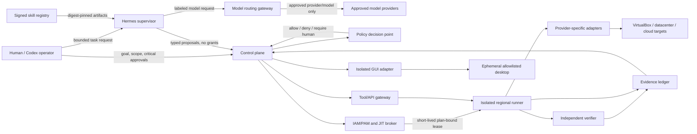

# Hermes Swarm, Model Routing, and Computer-Use Governance

## Purpose and current status

This extends the A2Z control-plane architecture with Hermes-style multi-agent orchestration, a provider-neutral model gateway, governed skills, and isolated GUI automation. These are integrations to build; they do not change the authority model or assert that any component is installed.

At handoff time, Hermes is not installed or connected, no OpenRouter-like gateway has been selected or wired, Computer Use is not deployed, and the Ubuntu host is not connected. No new capability is active. The first live milestone remains read-only Ubuntu/VirtualBox inventory as described in `CODEX_UBUNTU_VIRTUALBOX_ONBOARDING.md`.

## Authority and component boundaries

The control plane remains the policy authority and sole grant path. Hermes coordinates specialist agents and proposes typed work; it is not an authorization service. Models—including models selected through an OpenRouter-like gateway—generate analysis and plans but cannot approve them, mint credentials, or call provider executors. The policy decision point, approval service, IAM/PAM broker, and isolated execution boundary remain separately enforced controls. Hermes command-approval prompts are defense in depth, not a substitute for these controls.

Codex is the human-facing goal and approval surface. Hermes is an optional swarm runtime behind the same task, policy, identity, and evidence contracts. Neither inherits broad user shell credentials. Codex and Hermes Computer Use integrations, if enabled, are distinct adapters and each passes through the same policy enforcement point.

## Goal-to-evidence lifecycle

1. **Goal intake:** bind the request to tenant, human subject, declared scope, data classification, time window, and autonomy profile.
2. **Read-only discovery:** use approved inventory and evidence; stale or incomplete observations make a plan ineligible for execution.
3. **Typed plan:** delegate bounded analysis to specialists. Each proposed action has exact targets, operation, preconditions, expected effects, impact estimate, rollback, and verifier.
4. **Deterministic evaluation:** policy code checks identity, scope, artifact digests, data handling, risk, budget, concurrency, and autonomy envelope. Agents cannot set this result.
5. **Authorization:** deny, queue for named human approval, or authorize only within a signed, expiring standing policy. Any plan change invalidates prior approval and plan-bound grants.
6. **JIT execution:** issue a short-lived, single-purpose, target/operation/plan-bound capability to an isolated runner. Agents and model gateways receive no provider credentials.
7. **Canary and verification:** execute the smallest eligible canary, enforce stop conditions, and verify postconditions through an independent observer. Unknown outcome is not success; it opens the circuit breaker.
8. **Evidence and closure:** persist goal, agent lineage, model-route metadata, skill/tool digests, policy and impact results, approval, lease, runner receipt, verification, and rollback in the tenant evidence chain.

The state progression is `proposed -> evaluated -> (denied | awaiting approval | authorized) -> leased -> canary -> verified -> closed`. Timeout, identity change, changed target/plan, kill switch, missing evidence, or failed verification transitions to `stopped/unknown`, revokes remaining capability, and requires reconciliation before retry. Model/provider failover may retry inference only; it must never replay an infrastructure side effect.

## Swarm and IAM/PAM contract

- Give each human, agent, runner, verifier, connector, and GUI session a distinct identity. Bind actions to tenant, parent task, agent/run ID, immutable artifact digests, target scope, and correlation ID.
- Agents get only tools named in their signed runtime profile. Delegation can reduce authority, never expand it; child tasks inherit the tighter of parent scope and their own profile. Bound fan-out, depth, concurrency, duration, model spend, and retries.
- Use workload identity (OIDC/SPIFFE or platform-native equivalent) and short-lived JIT credentials. Never pass long-lived user/provider secrets in prompts, environment dumps, skill files, or agent messages. Redact secrets before model routing.
- Separate policy administration, policy decision, human approval, credential issuance, execution, and independent verification. No agent/service may both propose and authorize its own privileged action.
- Break-glass is a separate human-controlled, strongly authenticated path with JIT scope, expiry, reason, notification, session recording, and post-event review. It is not a swarm fallback mode.
- Route tool calls through a narrow registry and gateway. Per-MCP-server allowlists are explicit; begin with one read-only tool, not an entire administrative API. Tool schemas and returned content are untrusted input.

The proposed machine-readable profile contract is `../schemas/swarm-agent-profile.schema.json`. It describes constraints, not an authorization decision; enforcement belongs to the control plane and runner, not the Hermes process.

## Skills as a supply chain, not authority

1. Accept skills only from an approved internal registry or allowlisted source; fetch into quarantine without credentials or execution.
2. Pin source revision and content digest; retain provenance, license, dependency/SBOM data, scanner report, and review record.
3. Run static/semantic scanning, secret/dependency checks, policy tests, and adversarial prompt-injection tests. A clean scan is not proof of safety; use isolated runtime execution and egress controls.
4. Promote through a signed, human-reviewed release. Enforce approved digest IDs at runtime; revoke by digest and stop active sessions when necessary.
5. Skills may explain/request tools but cannot install themselves, add tools, elevate identity, modify policy, or authorize tasks. Self-authored and user-submitted skills remain proposals through the same promotion gates.

Production must not use Hermes dangerous-command approval `off`/`--yolo` as an authorization mechanism. Keep local command approvals enabled, while the independent policy and JIT gates decide whether infrastructure actions run.

## Provider-neutral model routing

Use an OpenRouter-like gateway for routing/accounting, not as an infrastructure-security boundary. A versioned route policy binds task/tenant data classification; approved provider, model, region, and endpoint set; provider retention/training terms and permitted data types; allowed tool/function calling (normally none for infrastructure mutation); prompt/response size, rate, cost, and latency budgets; redaction rules and audit metadata; and fallbacks limited to routes with equal-or-stronger privacy, residency, and capability constraints.

The gateway receives no infrastructure credentials. Provider-side zero-data retention does not keep a request inside the customer's network: requests still reach providers, and gateway logs, telemetry, tools, and support systems need separate retention controls. If no route satisfies classification/residency, fail closed or use an approved local model. Record route-policy version, provider/model, region, request ID, and usage/cost without retaining raw sensitive prompts unless explicitly authorized.

## Computer Use boundary

Prefer typed APIs and provider-native adapters. GUI automation is a separate, lower-confidence fallback:

- Run it in a disposable isolated VM/desktop with no host filesystem, clipboard, SSH agent, password manager, or general network access.
- Allowlist exact applications/sites and define action schemas, session limits, step/time/cost budgets, and emergency cancellation.
- Begin read-only. Require explicit human confirmation for consequential changes.
- Never type, reveal, or extract passwords, recovery codes, private keys, or session tokens through a model-facing GUI.
- Treat screenshots, page text, dialogs, and documents as untrusted, possibly prompt-injected content that cannot change scope or policy.
- Verify resulting state with an independent API/observer, not only a screenshot or agent narration. Record privacy-minimized evidence.

## Adoption moat without customer-data lock-in

Build advantage through broad conformant connector coverage; portable audited policy packs; evidence lineage and replay; independently scored reliability/security benchmarks; a vetted skill/integration ecosystem; regional deployment expertise; and transparent cost, residency, and retention controls. Keep policy and evidence exportable. Do not train shared models on customer data or create artificial switching costs without explicit informed opt-in.

Track time to onboard an environment, inventory accuracy, eligible-task completion, approval precision/override rate, independent verification, rollback/recovery, evidence completeness, policy violations, spend per verified task, and skill/connector revocation response time. Publish benchmark scope and failure rates, not only success demos.

## Deployment gates before and after Ubuntu access

| Gate | Scope | Exit criteria |
|---|---|---|
| A — Architecture/simulation | Schemas, mock agents/providers, synthetic inventory | Tests prove agents cannot grant authority; failover cannot replay side effects; evidence chain is complete. |
| B — macOS operator setup | Optional Hermes; only mock or approved read-only MCP surface | Pin runtime/skills; explicit tool allowlist; no shell/admin tools; test revocation and audit. Skip installation until runtime/source is reviewed. |
| C — Ubuntu observation | Pinned-SSH read-only enrollment | Confirm host/VirtualBox inventory, baseline, identity, evidence, and disconnect/revocation. No worker or mutation. |
| D — One disposable VirtualBox VM | Later, after a named VM is selected and owner confirms expendability | Metadata-only canary; exact pre/postconditions; independent observer; tested stop, rollback, evidence. No lifecycle operation inferred. |
| E — Cloud/datacenter observation | One explicitly enrolled account/site/region at a time | Read-only identity/inventory; tenant isolation, quotas, region policy, and evidence verified. |
| F — Staged execution | Narrow provider-native runners, then bounded cohorts | JIT identities, signed plans, critical human approvals, independent verification, rollback, kill switches, and scale gates pass. |

Do not install Hermes, add skills, expose a GUI session, or change SSH policy as part of architecture-only preparation. The operator must first choose the runtime/provider and privacy/residency policy; Linux enrollment remains a separate explicit step.
