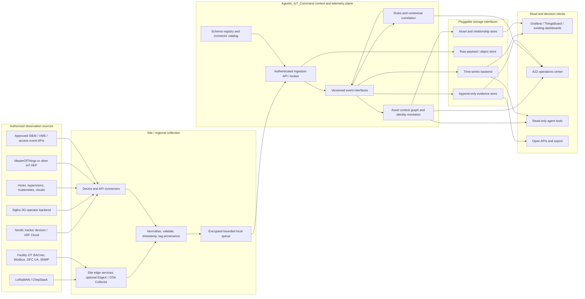
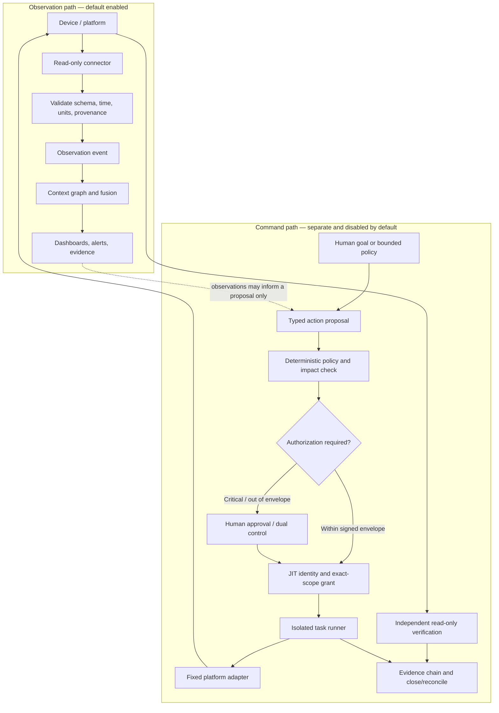
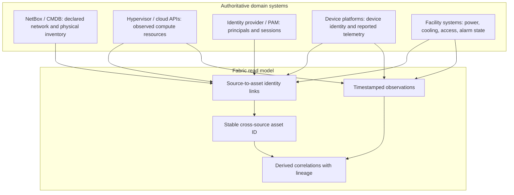
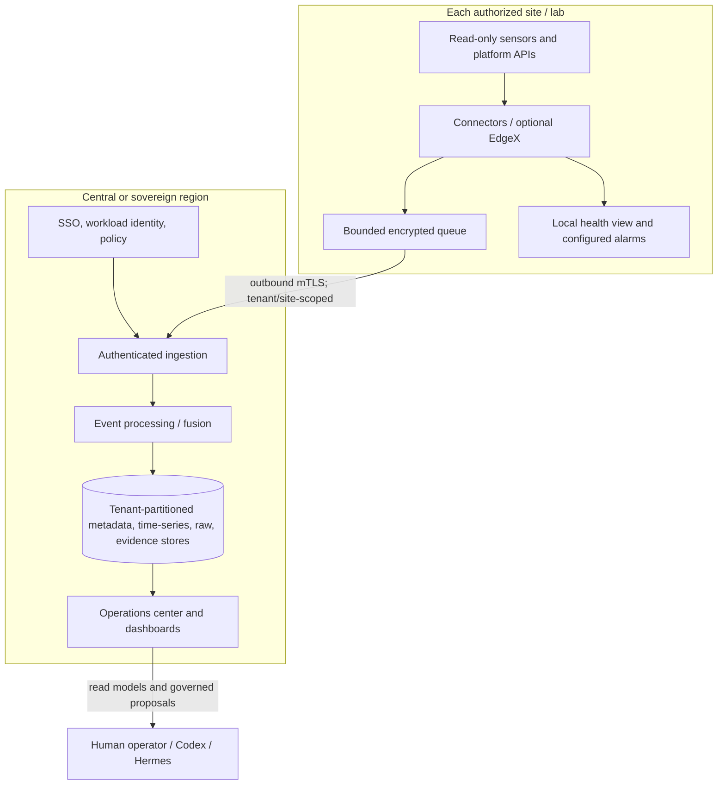

# Agentic_IoT_Command — Open Infrastructure Operations Architecture

## Executive definition

Build a vendor-neutral, open-source **context and telemetry integration fabric**
for physical IoT, data-center facilities, networks, hypervisors, Kubernetes,
clouds, identity systems, and operations agents. **Agentic_IoT_Command** is the
product brand for this operator-facing control plane.
product name, not yet cleared for trademark, domain, or repository use.

The project is not another sensor hardware company, LPWAN operator, device
cloud, SIEM, DCIM suite, or agent framework. Agentic_IoT_Command supplies the common contracts,
edge and cloud adapters, identity-resolution/context layer, evidence lineage,
conformance tests, and self-hostable integration experience that let those
systems work together.

The initial product promise:

> Connect an authorized source, see where its observations belong in the asset
> graph, understand their quality and provenance, and export or act on them
> through a separately governed control plane.

The OSS project should make read-only discovery and integration easy. It must
not turn telemetry visibility into implicit permission to control a device.

## Scope and non-goals

### In scope

- Common identity and relationship model for devices, sensors, gateways,
  locations, racks, VMs, services, cloud resources, and people/roles as needed
  for operational context.
- Typed observation/event model with units, timestamps, data quality,
  provenance, classifications, and references to raw source records.
- Pluggable connectors, edge normalizers, schema/conformance tests, event
  replay, simulators, APIs, SDKs, and dashboard integration.
- Contextual correlation and explainable derived events, with links to the
  source observations and the algorithm/rule version that produced them.
- Tenant, site, and region boundaries, local buffering, exportability, and
  auditable data access.

### Not the initial project

- A new LPWAN (Sigfox/0G, LoRaWAN, LTE-M, NB-IoT, Wi-Fi, Ethernet, etc. remain
  transports and provider/device ecosystems).
- A replacement for ThingsBoard, NetBox, EdgeX, Zabbix, Prometheus, Grafana,
  cloud-provider consoles, or a vendor's facility-management product.
- A general-purpose remote administration tool or unrestricted device-command
  bus.
- A safety controller for power, cooling, fire suppression, physical access,
  or other life-critical processes.
- A single "AI sensor fusion" model that hides data quality, assumptions, or
  uncertainty.

## Architectural principles

1. **Integrate before replacing.** Preserve specialist systems and their
   authority boundaries; ingest observations through documented interfaces.
2. **Open contracts, replaceable implementations.** Version the model and
   connector APIs; avoid a proprietary wire protocol or mandatory hosted
   account.
3. **Observed state is not desired state.** Record readings and changes as
   observations. Keep configuration intent in its source of truth (e.g.,
   NetBox, cloud inventory, CMDB, or a device manager) and preserve its owner.
4. **Raw, normalized, and derived data remain distinguishable.** Never
   overwrite the source record with a normalized or inferred value.
5. **Time, units, and quality are first-class.** Track event time, ingest time,
   clock uncertainty, units, calibration, stale status, and confidence.
6. **Read-only by default.** Telemetry connectors cannot issue commands.
   Actuation is a separate API, identity, policy decision, approval, and runner
   path.
7. **Edge resilience without silent authority.** Buffer and analyze locally;
   disconnected sites continue only the passive collection and pre-approved
   local alarms that are explicitly configured. Do not invent new authority
   while disconnected.
8. **Tenant and region boundaries are architectural.** Partition identity,
   credentials, queues, storage, keys, retention, and exports; do not rely on
   dashboard filters for isolation.

## System context



The OSS fabric owns **normalization, identity/context links, event lineage,
and portable interfaces**. It does not have to own every long-term telemetry
database or every dashboard. It can route to specialist systems of record and
provide a cohesive cross-system view.

## Separate observation and command paths



No dashboard button, device twin's desired-state field, agent message, model
response, or connector callback grants permission. If a later product supports
commands, the user sees the exact operation, target, impact, preconditions,
rollback, policy result, approval state, and verification status. A timeout or
ambiguous result is `unknown`, not success.

## Sensor-fusion pipeline

```mermaid
flowchart LR
  E1[Raw source event] --> AUTH[Authenticate source and tenant]
  AUTH --> SCHEMA[Validate schema and connector version]
  SCHEMA --> DEDUPE[Deduplicate / sequence-check]
  DEDUPE --> TIME[Normalize event time; retain ingest time and clock quality]
  TIME --> UNITS[Normalize units and measurement semantics]
  UNITS --> ID[Resolve stable asset ID and source identity]
  ID --> QUALITY[Attach calibration, missingness, quality, uncertainty]
  QUALITY --> CTX[Join site/rack/device/service relationships]
  CTX --> RULES[Rules, windows, temporal/spatial correlations]
  RULES --> DERIVED[Derived event with input refs and rule/model version]
  E1 --> RAW[Immutable raw record or digest/reference]
  DERIVED --> ALERT[Explainable alert / situation object]
  DERIVED --> EVID[Evidence lineage]
  ALERT --> HUMAN[Operator review or governed task proposal]
```



Fusion output is a new, versioned event; it never silently rewrites a sensor
reading. Correlations should state the matched asset IDs, temporal window,
threshold/model version, evidence references, and confidence/limitations. For
example, “rack inlet temperature rising while cooling unit reports reduced
output and power remains normal” is a hypothesis with supporting observations,
not an instruction to change HVAC controls.

### Minimum observation envelope

Use a versioned JSON Schema (and optionally Protobuf for high-volume binary
transport) with fields along these lines:

```json
{
  "schema_version": "1.0",
  "event_id": "urn:uuid:...",
  "tenant_id": "tenant-a",
  "site_id": "site-cairo-lab",
  "asset_id": "urn:a2z:asset:...",
  "source": {
    "connector_id": "sigfox-callback-v1",
    "device_id": "provider-device-id",
    "sequence": "provider-sequence-or-null"
  },
  "observed_at": "2026-09-24T10:20:30Z",
  "ingested_at": "2026-09-24T10:20:34Z",
  "clock_uncertainty_ms": 1500,
  "measurement": {
    "name": "temperature",
    "value": 27.4,
    "unit": "Cel"
  },
  "quality": {
    "status": "valid",
    "calibration_ref": "calibration-record-id",
    "uncertainty": 0.5
  },
  "classification": "internal",
  "raw_record_ref": "sha256:..."
}
```

This is illustrative, not a final schema. Define canonical units and semantics
before adopting field names. Device location can itself have a confidence and
source (GNSS, Wi-Fi, cellular, Sigfox Atlas, manually provisioned); don't
present an estimated location as exact.

## Data and context ownership



Each attribute has an explicit source-of-authority and precedence rule. The
fabric's graph is a linked operational read model, not a stealth replacement
CMDB. Resolve duplicates through a reviewable mapping; never merge two devices
only because their names or IPs look similar.

## Deployment architecture



Run collection close to devices; use outbound authenticated connections rather
than exposing management ports to the Internet. For poor connectivity, persist
locally with storage caps, encryption, replay protection, expiry, and explicit
retention. Do not allow a disconnected edge gateway to grant itself broader
control authority. Separate OT networks from ordinary enterprise/cloud
networks, and start with passive/read-only protocol access.

## Project repository and contributor experience

```text
opsatlas/
├── README.md / CONTRIBUTING.md / GOVERNANCE.md / SECURITY.md
├── spec/
│   ├── observation-schema/
│   ├── asset-context-model/
│   ├── connector-api/
│   └── event-and-error-catalog/
├── sdk/
│   ├── go/                       # suggested first adapter SDK
│   └── python/                   # suggested analytics/test SDK
├── services/
│   ├── ingestion-api/
│   ├── context-registry/
│   ├── identity-resolution/
│   ├── correlation-engine/
│   ├── replay-and-export/
│   └── authn-authz-integration/
├── connectors/
│   ├── sensors/                  # Nordic/nRF Cloud, LoRaWAN, Sigfox callbacks
│   ├── industrial/               # BACnet, Modbus, OPC UA, SNMP, ONVIF events
│   ├── infrastructure/           # NetBox, VirtualBox, Proxmox, VMware
│   ├── cloud/                    # AWS, Azure, GCP read-only inventory
│   └── platforms/                # ThingsBoard, MasterOfThings, EdgeX, OTel
├── dashboards/
│   ├── grafana-provisioning/
│   ├── thingsboard-imports/
│   └── operations-center-reference/
├── simulator/
│   ├── virtual-datacenter/
│   ├── sensor-streams/
│   └── fault-and-clock-skew-scenarios/
├── conformance/
│   ├── connector-testkit/
│   ├── schemas-and-units/
│   └── tenant-boundary-tests/
├── deploy/
│   ├── docker-compose-lab/
│   ├── edge-site/
│   └── sovereign-region/
└── docs/
    ├── architecture/
    ├── connector-guides/
    ├── threat-models/
    └── runbooks/
```

The tree is a target, not a reason to create dozens of microservices on day one.
Begin with schemas, a simulator, a thin ingestion API, a context registry, two
connectors, and dashboards. Keep process boundaries modular in code; split
deployables when isolation, throughput, availability, ownership, or independent
release needs justify it.

### Connector contract

Every connector should declare:

- supported source products/protocols and tested versions;
- read vs write capabilities (read-only is the default);
- identity and credential mechanism, scopes, secret handling, and rotation;
- network destinations, ports, and direction of connection;
- rate/volume limits, back-pressure behavior, retry/idempotency rules;
- data fields, units, timestamp semantics, quality limitations, and mapping;
- tenant handling, logs emitted, retention, and privacy classification;
- signed build provenance, SBOM, dependency support window, and owner.

Run third-party connectors as least-privileged, isolated plugins with scoped
credentials and egress allowlists. A connector must not receive an agent's
general credentials or be able to register a command capability implicitly.
Reject unknown schemas and fail closed on tenant/identity ambiguity.

### Developer quickstart should prove

1. One command starts a synthetic lab with fake host, VM, UPS, temperature,
   location, and link-quality signals.
2. A developer adds one connector using documented SDK contracts.
3. The conformance suite verifies schema, units, timestamps, duplicate handling,
   tenant isolation, provenance, retry behavior, and read-only capability.
4. A sample dashboard shows raw reading, normalized view, freshness, quality,
   topology context, derived alert, and evidence links.
5. Every generated record can be exported in documented open formats.

## Integration positions

| Existing project/vendor | Role in this ecosystem | Avoid claiming |
|---|---|---|
| Nordic nRF Asset Tracker Template | Firmware/device reference for Nordic nRF91 trackers; adapter consumes its approved cloud/API events | Hardware-neutral tracker firmware or unrestricted general-purpose OSS: the current template license restricts use to Nordic ICs. |
| Sigfox 0G / UnaBiz and national operators | LPWAN transport and operator/device ecosystem; ingest normalized callbacks/backend events | Broadband, guaranteed global service at every coordinate, or a self-hosted network. Check local operator, contract, radio rules, and on-site coverage. |
| SpimeSenseLabs MasterOfThings | IoT application enablement platform and possible source/partner integration | Open-source software or guaranteed interoperability until license, API, deployment, and export terms are confirmed. |
| EdgeX Foundry | Edge/device protocol services and local integration | Full central context graph, product dashboard, or control-plane authorization. |
| OpenTelemetry Collector | Standard software telemetry collection/processing/export | IoT device registry, data lake, or visualization backend. |
| ThingsBoard CE / Grafana | IoT dashboards and cross-source visualization, respectively | A replacement for per-asset authorization, quality/provenance policy, or evidence chain. |
| NetBox | Declared infrastructure inventory for chosen domains | A universal store for every live telemetry sample. |

The Sigfox public coverage map is indicative, not a guarantee. For any target
country—including Egypt—verify the current operator, subscription terms,
regulatory approval, indoor/underground coverage, and field performance before
choosing devices. Do not infer service availability from global headline
coverage.

For end-to-end energy-to-compute accounting, facility and IT operations,
operational workflows, SOP controls, and rollout gates, see
[`ENERGY_TO_COMPUTE_OPERATIONS.md`](./ENERGY_TO_COMPUTE_OPERATIONS.md).
For the modular command-center UI, MasterKeys/key custody, and commercial
entitlement boundaries, see
[`OPSATLAS_UI_UX_AND_COMMERCIAL_BOUNDARIES.md`](./OPSATLAS_UI_UX_AND_COMMERCIAL_BOUNDARIES.md).

## OSS and commercial boundary

### Keep open and self-hostable

- schemas, data model, event/API/connector contracts, SDKs, test suite, and
  simulator;
- core ingestion, identity linking, replay, export, and a functional local
  read-only deployment;
- baseline multi-tenant partitioning, audit events, deny-by-default behavior,
  and safe command interfaces (where implemented);
- reference dashboards and integrations with existing OSS projects;
- community connector catalog, documented support levels, and contribution
  governance.

### Sell operational assurance, not data lock-in

- managed regional control plane, HA, upgrades, backup/restore, support SLAs,
  and sovereign/private deployment operations;
- enterprise policy lifecycle, approval routing, advanced IAM/PAM/JIT
  integrations, session evidence, compliance attestations, and audit packages;
- certified connectors with tested compatibility, secure maintenance,
  commercial support, and vendor/operator coordination;
- fleet-scale quotas, site federation, data-boundary controls, and managed
  retention/residency;
- premium correlation/forecasting, fleet benchmarking, governed agent/model
  routing, and assurance evaluations—with explainability and customer control.

Do not make customers pay to extract their own data, self-host the core,
understand derived-event lineage, use basic safety controls, or integrate
through documented APIs. Make connector and policy portability a trust signal.

## Rollout and proof points

1. **Specification and simulator:** define the event contract and threat model;
   demonstrate VirtualBox, synthetic sensors, and fake vendor callbacks.
2. **Ubuntu read-only pilot:** install only edge observation components on the
   authorized host; ingest VirtualBox inventory and synthetic/environmental
   readings; no actuator or VM mutation.
3. **One genuine device family:** test a Nordic tracker or a locally available
   LPWAN sensor. Prove provisioning, clock quality, outage buffering, identity
   mapping, data export, and revocation.
4. **One facility protocol:** add one read-only SNMP or BACnet integration only
   with the facility owner, approved network zone, and protocol-specific
   credentials. Avoid polling sensitive/control networks broadly.
5. **Context and fusion pilot:** correlate two or three well-understood signals
   with explicit rules, labeled uncertainty, operator review, and replayable
   evidence. Keep actions disabled.
6. **Federation:** add a second site and tenant, test isolation, loss of WAN,
   delayed/reordered events, duplicate delivery, clock skew, data deletion and
   restore, and regional failover.
7. **Separately governed actuation:** only after the control-plane gates in the
   architecture handoff; never use the sensor connector as the privileged
   runner.

Measure connector onboarding time, schema/conformance pass rate, observation
freshness, asset-resolution accuracy, duplicate/out-of-order rates, false
correlation rate, operator confirmation/rejection rate, export completeness,
edge recovery, per-tenant isolation, and cost per verified operational outcome.
Publish benchmark datasets and failure modes. Do not claim “global” coverage or
“autonomous” reliability from a single lab demonstration.

## References checked

- [Nordic Asset Tracker Template](https://github.com/nrfconnect/Asset-Tracker-Template) and [its license](https://github.com/nrfconnect/Asset-Tracker-Template/blob/main/LICENSE)
- [MasterOfThings by SpimeSenseLabs](https://www.spimesenselabs.com/MasterOfThings-IoT-AEP/)
- [Sigfox 0G coverage and local operators](https://sigfox.com/coverage/) and [radio regions](https://build.sigfox.com/sigfox-radio-configurations-rc)
- [EdgeX Foundry platform](https://www.edgexfoundry.org/software/platform/)
- [OpenTelemetry Collector](https://opentelemetry.io/docs/collector/)
- [ThingsBoard Community Edition documentation](https://thingsboard.io/docs/why-thingsboard/)
- [Grafana OSS](https://grafana.com/oss/grafana/)
- [NetBox source-of-truth planning](https://netbox.readthedocs.io/en/stable/getting-started/planning/)
