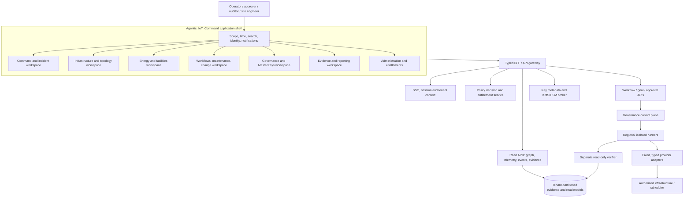
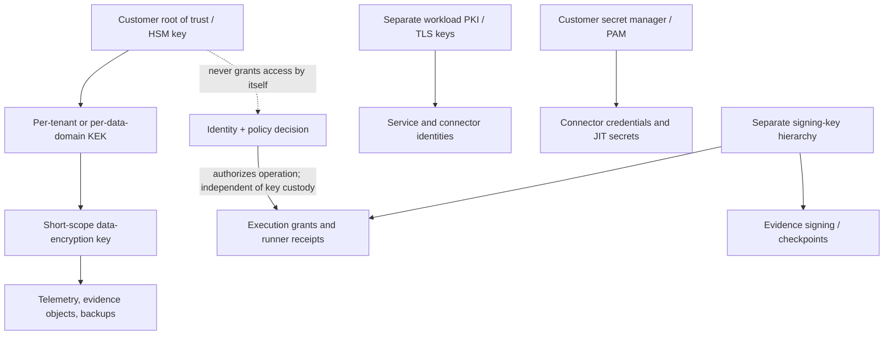
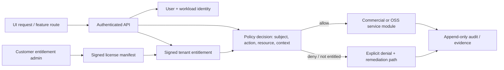
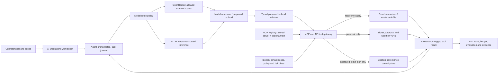

# Agentic_IoT_Command UI/UX, Module Architecture, MasterKeys, and Commercial Boundaries

## Purpose and terminology

This document defines how the Agentic_IoT_Command operator experience composes the
energy-to-compute and data-center operations capabilities into a clean,
modular product. It also defines the boundary between open-source foundations,
commercial extensions, tenant entitlements, and customer-controlled keys.

Here, **MasterKeys** means the customer-controlled cryptographic root of trust
and its key-custody lifecycle. It does **not** mean a universal administrator
credential, a command authorization token, or a key that can decrypt every
tenant by default. If “MasterKeys” is intended as a different product concept,
the product terminology should be revisited before implementation.

Security is enforced by identity, policy, cryptographic boundaries, and
deployment isolation—not by hiding a menu item or keeping code obscure. The UI
communicates those controls and gives operators auditable workflows; it never
becomes the authorization engine.

## Product information architecture

Use a persistent shell with a small set of stable operational domains. Modules
are discoverable by capability and entitlement, while the same navigation
works for a single VirtualBox lab and a federated multi-region fleet.

```text
Agentic_IoT_Command
├── Command
│   ├── Situation overview
│   ├── Incidents and event timeline
│   └── Service impact / dependency path
├── Infrastructure
│   ├── Sites, rooms, rows, racks, assets
│   ├── Topology and source reconciliation
│   ├── Virtualization, Kubernetes, cloud
│   └── Networks, IoT, sensors and gateways
├── Energy & Facilities
│   ├── Energy-to-compute
│   ├── Electrical one-line and capacity
│   ├── Cooling, thermal and water
│   ├── Carbon, cost and utility signals
│   └── Power / thermal / service trends
├── Operations
│   ├── Workflows and runbooks
│   ├── Change, maintenance and commissioning
│   ├── Capacity and workload proposals
│   └── Incident / continuity exercises
├── Governance
│   ├── Policies, approvals and autonomy envelopes
│   ├── Identities, PAM and sessions
│   ├── MasterKeys / Trust Center
│   └── Connectors, skills and model routes
├── Evidence & Reporting
│   ├── Evidence graph and audit timeline
│   ├── Energy / compute reports
│   ├── Compliance exports
│   └── Benchmarks and conformance
└── Administration (role and entitlement gated)
    ├── Tenant, sites, regions and data boundaries
    ├── Users, teams and delegated ownership
    ├── Integrations, retention and deployment health
    └── Commercial entitlements and support
```

### Global shell

- **Scope selector:** tenant → organization → region → site → environment. The
  active scope is always visible and included in all searches, exports, and
  proposed actions. Never silently broaden a query from one site to “global.”
- **Time control:** common time cursor and interval across energy, facility,
  workload, event, and change views; show timezone and whether timestamps are
  event time or ingest time.
- **Freshness and source health:** always-visible stale-data, connector, meter
  coverage, and synchronization state. Distinguish “healthy” from “not
  observed.”
- **Command palette/search:** search assets, work orders, incidents, policies,
  evidence IDs, and approved procedures; search results remain scoped by the
  caller's authorization.
- **Critical event tray:** incident severity, owner, age, affected service, and
  acknowledged/unacknowledged state. Do not use color as the only signal.
- **User/security context:** current identity, role, session assurance, tenant,
  and any just-in-time elevation expiry. Indicate when the session is
  read-only, approval-capable, or has an active time-bounded grant.

### Command-center page anatomy

The default page answers five questions in this order: **what changed; what is
affected; how reliable is the evidence; who owns the next decision; what is the
safe next step?**

1. Situation strip: active priority incidents, fleet/service health, energy
   and compute coverage, stale sources, and critical capacity constraints.
2. Workload/energy picture: facility and IT demand against useful workload
   output over one aligned timeline; show meter boundaries and estimation tier.
3. Dependency map: site → electrical/cooling path → rack → platform → workload
   → service; show redundant paths and common failure domains.
4. Attention queue: incidents, data-quality exceptions, pending approvals,
   maintenance conflicts, expiring credentials, and key lifecycle events.
5. Evidence and action drawer: selected item's source records, lineage,
   affected entities, quality/confidence, current policy, procedure, and
   proposed next action.

Avoid a single “AI health score,” excessive animated maps, ambiguous red/green
status, or a wall of equally weighted charts. Prioritize operator decisions,
not visual density. Progressive disclosure should expose raw telemetry and
advanced configuration without overwhelming shift operators.

## Front-end module and service boundaries



The frontend is a client of typed APIs, not a privileged adapter. It never
holds cloud credentials, root keys, runner certificates, or long-lived secrets.
Use a backend-for-frontend (BFF) only for session-bound presentation and
aggregation; authorization remains in trusted services and is repeated at the
resource operation. Routes and buttons are convenience, not security barriers.

### Suggested UI package structure

```text
apps/opsatlas-web/
├── app-shell/                 # routing, scope, session, theme, navigation
├── design-system/             # accessible tokens, components, interaction patterns
├── domains/
│   ├── command/
│   ├── infrastructure/
│   ├── energy-facilities/
│   ├── operations-workflows/
│   ├── governance-masterkeys/
│   ├── evidence-reporting/
│   └── administration/
├── shared/
│   ├── typed-api-client/
│   ├── entity-linking/
│   ├── time-series/
│   ├── policy-status/
│   └── audit-context/
└── tests/
    ├── accessibility/
    ├── authorization-visibility/
    ├── tenant-scope/
    ├── workflow-contract/
    └── visual-regression/
```

Keep modules independently owned and testable, but do not split the UI into
microfrontends unless teams need independent deployments and the isolation
tradeoff is justified. Define shared entity, time, evidence, freshness,
severity, and authorization components once. Domain modules own their page
composition and APIs; they must not each invent their own notion of a healthy
asset, time interval, or approval status.

## Common interaction and workflow contracts

Every module uses common typed objects: `TenantScope`, `SiteScope`, `AssetRef`,
`ObservationRef`, `EvidenceRef`, `Freshness`, `Confidence`, `ImpactSummary`,
`PolicyDecision`, `ApprovalState`, and `WorkflowCase`. Preserve source IDs and
unit/provenance data through navigation and exports. Every route, query, and
mutation request carries the authorized scope explicitly; the server derives
effective authorization from identity and policy rather than trusting a UI
scope claim.

```mermaid
stateDiagram-v2
  [*] --> Observed
  Observed --> Triaged: operator validates scope and evidence
  Triaged --> Prepared: typed plan + impact + procedure
  Prepared --> PolicyCheck: deterministic rules and current state
  PolicyCheck --> Held: missing evidence / conflict / unsafe envelope
  Held --> Prepared: corrected plan and renewed evidence
  PolicyCheck --> Approval: approval required
  PolicyCheck --> Authorized: standing policy permits exact bounded action
  Approval --> Authorized: approved by required identities
  Approval --> Rejected: denied / expired
  Authorized --> Executing: one-use short-lived grant
  Executing --> Verifying: execution receipt
  Executing --> Unknown: timeout or ambiguous outcome
  Unknown --> Verifying: reconcile actual state; no blind retry
  Verifying --> Closed: independent postcondition and evidence accepted
  Verifying --> Held: mismatch / incomplete evidence
  Rejected --> [*]
  Closed --> [*]
```



Keep each state visible in the UI and API. `Held`, `Rejected`, `Unknown`, and
`Aborted` are real outcomes, not generic errors. If a workflow proposes an
energy-aware compute placement, show the alternatives, expected cost/carbon,
SLO and residency constraints, forecast uncertainty, policy result, approving
owner, and scheduler verification in the same case record.

## MasterKeys / Trust Center

### Key hierarchy and separation of purpose

Use provider-neutral KMS/HSM interfaces while allowing customer custody in
their cloud KMS, on-prem HSM, or approved external key manager. Agentic_IoT_Command stores
key identifiers, versions, policy metadata, and cryptographic operation
receipts—not exportable root key material.



These key purposes must not collapse into one “master” key: data encryption,
signing/attestation, TLS/workload identity, and connector/PAM secrets have
separate owners, APIs, cryptoperiods, and compromise procedures. A root key
does not grant a person or agent permission to read, export, or mutate data;
identity and policy decide those permissions. Similarly, a product license is
not a decryption key, and a signing key is not a data-encryption key.

### MasterKeys UI

The Trust Center displays, by tenant and data domain:

- custody mode (`customer KMS/HSM`, `customer on-prem HSM`, or explicitly
  `vendor-managed` where contractually supported);
- provider/key reference, key version, enabled/disabled/rotation-required
  state, cryptoperiod dates, last successful cryptographic operation, and
  backup/recovery test date;
- which data domains and regions depend on the key, and the impact of loss,
  revocation, or rotation;
- key administrators, required approver count, dual-control policy, emergency
  contacts, and the last audited change;
- status of signing trust roots, workload certificates, connector secrets,
  and encryption keys as separate panels, never conflated as one “key health.”

Never show raw key material, private-key bytes, recovery shares, or secret
values. Do not include them in browser storage, telemetry, screenshots, agent
prompts, audit text, or support bundles. UI actions are request workflows:
create/attach reference, rotate, disable, recover, or schedule crypto-erasure.
Each action explains dependencies, expected availability impact, backup/legal
hold checks, approvers, and a validated rollback/recovery path before approval.

### Key lifecycle controls

| Operation | Required controls | Visible evidence |
|---|---|---|
| Provision / bind | Customer admin; approved HSM/KMS endpoint; tenant/domain scope; test encrypt/decrypt round-trip | Key reference, custody owner, policy version, test receipt |
| Rotate | Planned key version; dual control for root changes; data rewrap/re-encryption plan; verification and rollback | Old/new version relation, completion coverage, residual dependency report |
| Revoke / disable | Incident/change case; impact simulation; authorized key custodian and second approver for high impact | Revocation decision, affected encrypted objects/services, observed denial test |
| Recover | Documented recovery quorum; offline or separately protected backup; break-glass case; witnessed validation | Participants, approvals, custody event, recovery test, post-use review |
| Destroy / crypto-erase | Explicit customer instruction; retention/legal hold check; backup and replica inventory; second-person confirmation | Scope, irreversible consequence, destruction receipt, residual-copy exceptions |
| Compromise response | Stop affected signing/decryption use; revoke dependent credentials/certs; rotate/reissue; reconcile grants and evidence | Incident timeline, revocation propagation, reissue and recovery validation |

Root operations use separation of duties and split knowledge where appropriate.
Break glass is time-limited, reason-bound, notified, independently reviewed,
and cannot suppress ledger evidence. Key backup and recovery are part of the
availability plan; losing the root key can make encrypted data unrecoverable.
The product must test and document this failure mode rather than imply that
“customer-owned keys” remove it. Follow a documented key-management policy and
cryptoperiods; do not invent a single universal rotation interval.

## Open-source and commercial product boundary

### Capability partition

| Open foundation | Commercial extensions (examples) | Boundary rule |
|---|---|---|
| Schemas, event and asset contracts, connector SDK, simulator, conformance tests | Certified connector packs, compatibility lab, vendor support | Connector contract and test harness stay open; paid certification/support adds assurance, not secret wire formats |
| Self-hosted read-only inventory/context, normalized observations, basic dashboards, replay/export | Large-scale federation, HA operations, managed regional service, premium retention/residency operations | Customer can self-host, export, and understand the data; hosted service does not own the only copy |
| Baseline policies, local audit, evidence references, API/CLI | Enterprise approval lifecycle, advanced IAM/PAM/JIT workflows, signed attestations and audit packages | Enforcement is server-side and independently testable; hiding UI is never the control |
| Basic metrics and transparent rules | Fleet energy benchmarking, advanced forecasting/optimization, managed model routing and premium evaluations | Models are optional, explainable, customer-configurable, and cannot bypass deterministic gates |
| Core key-provider abstraction and documented local development mode | Enterprise KMS/HSM integrations, custody workflows, managed key operations/support | Customer retains key custody choices; no vendor escrow is silently introduced |

Commercial code is protected by separate package/repository and deployment
boundaries where appropriate, signed release artifacts, SBOM/provenance,
least-privilege service identities, and contractual licensing. Proprietary
logic should run server-side or in a separately deployable extension; do not
ship vendor secrets in the web client, connector SDK, or public container.
There is no technical way to prevent copying code that is intentionally
distributed under an open-source license: protect the commercial business with
licenses for genuinely proprietary modules, trademarks, certified services,
support, hosted operations, and continued product execution—not with a claim
that open code is secret.

### Entitlement and authorization evaluation



Every protected request checks both **authorization** (may this identity
perform this operation on this resource?) and **entitlement** (is this tenant
licensed for this optional module/scale?). An entitlement does not grant
permission; a user role does not buy an entitlement. UI navigation may show
licensed, unavailable, or trial status but the server repeats the check for
every API, export, job, and background worker.

Signed entitlement manifests should bind issuer, tenant/customer ID, product
and module IDs, allowed limits, issue/expiry times, version, and signing-key
ID. Support online revocation plus a documented offline deployment and renewal
policy. Avoid placing personal or secret data in the token. Log decisions
without logging secrets. Fail closed for new premium operations when an
entitlement cannot be validated, but **never disable safety, data export,
customer key rotation/revocation, security remediation, or access to existing
audit evidence because a subscription expired**. Expiry must not trigger
destructive workload or facility actions. Provide export and orderly downgrade
paths.

## Security, accessibility, and dynamic UX requirements

- Enforce server-side tenant/site scope for pages, APIs, websocket/subscription
  channels, search, exports, and saved dashboards. Test direct URL and API
  access, not only hidden navigation.
- Re-check authorization on every operation and after role/session changes;
  use short-lived sessions/elevation, phishing-resistant MFA for high-impact
  approvals, and explicit step-up before privileged workflows.
- Render critical statuses with text/icon/shape plus color; support keyboard
  operation, screen readers, zoom, reduced motion, and WCAG 2.2 AA target
  conformance. Dynamic updates must not steal focus or announce every sensor
  tick to assistive technology.
- Show stale, delayed, estimated, uncalibrated, and conflicting values as
  distinct states. Do not smooth away a spike that is operationally material.
- Every consequential UI action previews scope, impact, authorization mode,
  expected cost/service effects, stop conditions, and evidence requirements.
  High-risk operations require deliberate confirmation and configured dual
  control; never use confirmation dialogs as the only control.
- Keep navigation and dashboards fast using cursor-based pagination,
  server-side aggregation, bounded time ranges, and explicit sampling. Mark
  sampled/downsampled charts and preserve drill-down to raw source evidence.
- All dashboard layouts, saved views, report exports, and AI summaries obey
  tenant data boundaries and retain source citations/evidence IDs.

## Acceptance tests before product release

1. A read-only user can see a synthetic energy-to-compute command view with
   defined meter boundaries, compute-output units, data-quality states, and
   drill-through evidence.
2. A site engineer can move from a thermal/electrical signal to affected
   assets, approved SOP, owner, maintenance state, and an auditable case without
   exposing a control-network command channel.
3. A user lacking a commercial entitlement cannot invoke its API directly;
   an entitled but unauthorized user is still denied. A hidden UI route is not
   considered a pass.
4. Tenant A cannot read Tenant B assets, key metadata, entitlement records,
   search results, saved views, exports, or event streams by changing an ID.
5. The browser and AI/model traces never contain key material, private signing
   keys, connector secrets, recovery shares, or bearer grants.
6. A key rotation can be requested, approved under separation of duties,
   verified end-to-end, and rolled back or held safely when a dependency fails.
7. Loss of KMS/HSM connectivity produces an explicit degraded state, preserves
   encrypted data and evidence, and prevents new protected operations without
   inventing a fallback key.
8. Subscription expiry blocks new premium work but preserves key lifecycle,
   security controls, evidence read/export, and safe downgrade.
9. Keyboard, assistive-technology, responsive, and high-contrast tests cover
   incident and approval journeys, not only static pages.
10. A submitted/approved/executed change is linked to identity, plan digest,
    policy, entitlement, approval, grant, independent observation, and final
    evidence; timeout reconciliation cannot blindly replay the action.

## References

- NIST, [SP 800-57 Part 1 Rev. 5: Recommendation for Key Management](https://csrc.nist.gov/pubs/sp/800/57/pt1/r5/final): key types, protection, key inventory, lifecycle, and cryptoperiod guidance.
- NIST, [SP 800-207: Zero Trust Architecture](https://csrc.nist.gov/pubs/sp/800/207/final): protect resources and workflows through explicit identity/context authorization rather than implicit network trust.
- NIST, [SP 800-207A: Zero Trust for Cloud-Native Multi-Cloud Applications](https://csrc.nist.gov/pubs/sp/800/207/a/final): application/service identity and policy enforcement across multi-cloud environments.
- Energy-to-compute and facilities workflows: [`ENERGY_TO_COMPUTE_OPERATIONS.md`](./ENERGY_TO_COMPUTE_OPERATIONS.md).
- Product context, sensor fusion, and integration contract: [`OPSATLAS_ARCHITECTURE.md`](./OPSATLAS_ARCHITECTURE.md).
- Control-plane execution, IAM/PAM, and evidence boundaries: [`../ARCHITECTURE_HANDOFF.md`](../ARCHITECTURE_HANDOFF.md) and [`COMMAND_CENTER_PROJECT_STRUCTURE.md`](./COMMAND_CENTER_PROJECT_STRUCTURE.md).

## Agentic AI and MCP experience

### Product surfaces

Add an **AI Operations** workspace that is integrated with the operations
console but visually and technically separated from the authorization plane:

- **Agent directory:** agent name/owner, purpose, approved model routes, data
  classification ceiling, allowed MCP servers/tools, skills and digests,
  autonomy profile, budget, runtime/isolation profile, and last evaluation.
- **Task workbench:** user goal and target scope; agent plan; delegated subtasks
  and dependencies; evidence citations; MCP/tool calls; model/provider route;
  spend/latency; policy findings; approval state; cancellation and stop status.
- **Tool activity stream:** every MCP server and tool exposed for the run,
  exact arguments after redaction, data classification, result provenance,
  policy decision, approval state, duration, and output digest. Make calls
  inspectable before and during execution, not hidden in a chat transcript.
- **Agent evaluation:** task-specific success, tool-call validity, grounding,
  prompt-injection resilience, leakage tests, policy bypass attempts, cost,
  latency, and human acceptance/rejection. An aggregate score never grants
  more autonomy.
- **Approvals inbox:** exact task, change plan, targets, impact, evidence,
  policy, identity, expiry, and approvers. The approver can reject, narrow,
  request revision, or approve; approval is bound to the immutable plan digest.

The agent surface has three explicit modes: **Observe** (read-only evidence),
**Prepare** (draft plans, tickets, and reports), and **Execute an approved
plan** (a separate governed workflow). It must not present model-generated
actions as already-running changes. A conversation is never itself an approval
record.

### MCP control plane and UX

#### Agent-runtime integration workbench

Treat the runtime as an adapter, not as the authority plane. The Integration
Center should show runtime identity, adapter/version, supported MCP transports,
tool-schema conversion, streaming/cancellation behavior, trace correlation,
and the policy hooks used for human approval. Initial compatibility targets
are:

| Runtime family | Integration pattern | Product UX and boundary |
|---|---|---|
| Hermes Agent | MCP client/runtime adapter; import a reviewed server/tool allowlist | Show which native tools and MCP tools are enabled, agent profile, model route, skill digest, and local/remote execution boundary; never inherit Hermes-local permissions as Agentic_IoT_Command authority |
| LangGraph / LangChain agents | SDK adapter or MCP-backed tool bridge; correlate graph/thread/run identifiers | Render graph nodes and subagent delegation as a trace, attach policy decisions to tool calls, and route any approval interrupt to the shared approval inbox |
| Microsoft AutoGen | MCP workbench/tool adapter or OpenAI-compatible model client | Show agent/team topology and tool assignment; enforce per-agent and per-run scopes at the gateway, not only in framework configuration |
| Google ADK | Tool/MCP adapter and supported deployment/runtime metadata | Distinguish local development, customer runtime, and managed cloud deployment; link traces/evaluations without treating a framework session as a signed execution grant |
| Custom or future runtimes | Versioned adapter SDK over internal agent-run and tool-call contracts | Require conformance tests for identity propagation, tool filtering, cancellation, event ordering, trace IDs, and approval pauses before listing as supported |

The runtime profile page should expose adapter health, contract-test version,
runtime/agent version, tenant binding, effective model route, tool-manifest
digest, data-class ceiling, maximum delegation depth, concurrency/budget caps,
and stop/cancel state. A runtime that cannot propagate caller identity,
preserve plan/tool-call IDs, or pause for a governed approval is limited to
Observe/Prepare mode. Do not create a direct runtime-to-cloud credential path;
all infrastructure actions continue through the same scoped connector gateway
and existing execution-governance path.



MCP transports and models are **not** trusted identity or policy authorities.
An MCP server may expose tools, resources, and prompts; the gateway records
server identity/version and a digest of the visible tool manifest. Treat
descriptions and tool annotations as untrusted metadata until independently
reviewed. Tool availability is filtered by authenticated caller and scope,
but the server re-authorizes every call; filtering `tools/list` is not access
control.

#### MCP registry and server detail

The registry UI captures:

- source URL/repository, owner, maintainer, release, immutable artifact digest,
  build provenance, license, support status, and last reviewed date;
- transport (`stdio` local process or approved remote HTTP transport), network
  egress, allowed hosts, TLS identity, OAuth issuer/audience, scopes, and
  credential source;
- advertised tools/resources/prompts, JSON input/output schemas, data classes,
  side-effect/risk annotations, idempotency/cancellation semantics, rate
  limits, and timeout;
- static and dynamic checks, sandbox test evidence, prompt-injection/tool
  poisoning results, secrets scan, tenant-boundary test, and reviewer signoff;
- current users/agents allowed to invoke it, per-run exposure, revocation, and
  rollback to a previously pinned manifest.

New servers enter **quarantine** with no production credentials, no network
egress except a test allowlist, and no live tools. A developer may validate
tools against synthetic targets; promotion requires owner review, provenance,
conformance, security checks, and an explicit policy profile. Detect tool
manifest drift and fail closed or require re-review when a pinned server adds
or materially changes a tool. Do not auto-trust registry marketplace ratings.

#### MCP invocation safety model

1. The operator chooses an agent, tenant/site scope, task mode, and permitted
   data classification; the server constructs the effective scope from the
   authenticated identity.
2. The orchestrator fetches only pinned, policy-eligible MCP manifests; a
   model receives the minimum set of tools needed for this task.
3. A typed tool call is schema-validated, normalized, redacted as required,
   and evaluated by policy for subject, server, tool, arguments, target,
   classification, rate, budget, and side-effect class.
4. Read-only calls may run automatically within their scope. Writes create a
   proposal or approval case; execution requires the existing signed-plan,
   JIT, isolated-runner, and independent-verification path.
5. Tool output is size-limited, sanitized, provenance-tagged, and treated as
   untrusted data before re-entering a model context. Secrets and untrusted
   instructions are not followed as policy.
6. Store an auditable record of server/tool digests, exact effective scope,
   policy result, redacted argument/result digests, model/provider route,
   token/cost, approval, and resulting evidence IDs.

Use audience-bound tokens for the intended MCP resource, validate issuer and
audience, avoid forwarding an upstream bearer token to a different server, and
never put tool credentials into model context. Remote MCP servers are
third-party integrations and require the same privacy, residency, and supply-
chain assessment as API connectors. Follow the deployed MCP specification
revision and its security guidance; keep protocol version an explicit
compatibility field rather than hard-coding assumptions into the UI.

## OpenRouter and vLLM model-routing experience

Add a **Model Gateway** section under Governance, with separate pages for
provider connections, model catalog, route policies, budgets, privacy, and
run-time observability. Support external OpenRouter routing and customer-hosted
vLLM as different provider classes behind one internal inference contract.

### Provider configuration and route policy

| Surface | OpenRouter | vLLM |
|---|---|---|
| Connection | OpenRouter workspace, server-side API credential reference, permitted account/workspace | Customer endpoint, TLS/mTLS, deployment identity, served model IDs, health/version |
| Model catalog | Refresh provider/model catalog; pin allowed IDs and feature support | Import served model list and local capability metadata |
| Route choices | Provider allow/deny, ordering/fallback, BYOK policy, data-collection restrictions | Dedicated pool/endpoint per classification or workload; concurrency/context/budget limits |
| Health | provider availability, rate limits, latency, fallback route and usage | health/readiness, queue depth, accelerator utilization, tokens/sec, latency, OOM/error rate |
| Privacy | show provider/data handling and actual selected provider per generation | show customer deployment boundary and whether prompt/trace data leaves it |
| Governance | policy gates external data classes and allowed models | policy gates model identity, endpoint, network path, tenant isolation and tool capability |

Every route policy binds task class, data classification, tenant, residency,
allowed provider/model IDs, required capabilities (JSON schema, tool calls,
vision, context length), quality/evaluation floor, cost and latency ceiling,
fallback behavior, and human override. Make model aliases resolve to an
immutable model/provider identity for each run and record that identity in the
evidence trace. A routing or model-catalog change requires review and a
canary/evaluation period before production promotion.

For OpenRouter, show that a unified endpoint can route to multiple underlying
providers. Do not infer that a workspace setting or BYOK selection means a
request will never fall back to a different provider: represent the effective
provider/fallback behavior in the route policy, configure provider allowlists,
and block routes whose data handling has not been approved. Keep API keys in a
customer/tenant secret manager or HSM-backed secret store; never expose the key
after creation or send it to a browser or model. Review the provider's current
retention/training terms and account-level privacy settings before enabling a
route.

For vLLM, provide a connection preflight for TLS, endpoint identity, model
availability, tool calling, structured output, limits, and a harmless test
prompt. Require an authenticated reverse proxy/API gateway, network policy,
rate limits, and endpoint monitoring. Do not rely on the vLLM `--api-key`
option alone to protect a deployment: current vLLM documentation notes that
some endpoints outside its authenticated route prefixes may remain exposed.
Expose the approved endpoint through the inference gateway, not directly to
agents or browsers.

### Per-run route and data disclosure

Before a run, show an **Inference route card**: task and classification;
redaction/minimization applied; local or external route; provider/model; region
if known; retention/training policy reference; tool-call capability; budget;
fallback constraints; and an explanation of why this route is eligible. If
route selection changes during retry/fallback, record it and surface the
change. For restricted data, fail closed rather than silently using an
external fallback. Provide customer-controlled retention of prompts and
responses; default to content-minimized traces and preserve usage, route,
latency, and policy metadata where content logging is disabled.

## Integration API catalog: coverage and organization

“All vendor APIs” is not a finite deliverable: APIs differ by product line,
firmware, customer tier, geography, contractual access, version, and
deprecation state. Agentic_IoT_Command should instead maintain a **living Integration
Catalog** that can inventory official API surfaces, import machine-readable
specifications when available, and make coverage gaps explicit. Connector
status is per exact product/API version and capability—not a blanket badge for
an entire manufacturer.

### Integration Center information architecture

```text
Integrations
├── Catalog             search by vendor, protocol, product, capability, region
├── Connected systems   tenants, sites, scopes, credential health, last sync
├── API surfaces        operations, versions, OpenAPI/AsyncAPI/GraphQL/SDK/protocol
├── Connector lifecycle discovery → test → review → pilot → supported → deprecated
├── Data mappings       source fields ↔ canonical asset/observation/workflow objects
├── Health & limits     freshness, quota, throttling, lag, retries, errors
├── Security            identity, scopes, TLS, egress, secrets, revocation
└── Coverage roadmap    requested APIs, gaps, owners, community/vendor status
```

Each connector detail page shows vendor/product/API version; tested firmware
and regions; available operation groups; read/write boundaries; auth scopes;
data types and mappings; rate limits and paging; known gaps/deprecations;
conformance status; support owner; release provenance; last successful sync;
and a “test connection” action that makes only a minimal, read-only request.
Separate **API discovered**, **connector implemented**, **vendor-certified**,
and **production-supported** states. “Connected” means authenticated and
recently observed—not that every API is supported.

### Connector factory and catalog ingestion

```mermaid
flowchart LR
  SPEC[Official OpenAPI / AsyncAPI / GraphQL / SDK / protocol reference]
  SPEC --> DISC[Spec importer + API/version inventory]
  DISC --> DIFF[Change and deprecation detector]
  DISC --> MAP[Candidate field/operation map]
  MAP --> SCAFF[Generated adapter scaffold; no credentials]
  SCAFF --> TEST[Contract tests, fixtures, simulated endpoint]
  TEST --> SEC[Threat review, scope review, licensing and privacy review]
  SEC --> HUMAN[Maintainer and domain-owner approval]
  HUMAN --> SIGN[Signed, versioned connector release]
  SIGN --> REG[Catalog and per-tenant deployment]
  REG --> MON[Freshness, quota, errors, capability use]
  MON --> DIFF
```



Only official/vendor-authorized references are production inputs; community
schemas and reverse-engineered endpoints are marked experimental, cannot
request broad credentials, and require explicit opt-in. Generated code is
untrusted until tested/reviewed. The connector runner receives a dedicated,
least-privilege identity, secret reference, fixed destination allowlist, and
typed operations. Read and write capabilities are separate packages or
profiles. Device twin, shadow, direct method, firmware, and control functions
are treated as writes even where the vendor calls them “desired state.”

### Initial vendor/API coverage portfolio

This is a **priority seed catalog**, not a claim of complete coverage. Confirm
current availability, contract, regional access, API version, scopes, and
product-specific support at onboarding. Prioritize inventory, telemetry,
events, health and usage before commands, configuration, firmware, or actuation.

| Provider family | First catalog surfaces | Important UX / lifecycle caveat |
|---|---|---|
| AWS | AWS IoT Core control/data plane, Thing Registry, Device Shadows, Jobs, Wireless/LoRaWAN; broader AWS APIs for Organizations, EC2, EKS, CloudWatch, billing/cost | Separate control plane from device data plane and account/region scopes; shadow desired-state writes are mutations |
| Microsoft Azure | IoT Hub REST (identity, twins, jobs, direct methods), Device Provisioning Service, Azure Resource Manager, Monitor, AKS, Cost Management | Split IoT Hub device/service/resource endpoints; Entra identity and RBAC scopes are visible per operation |
| Google Cloud | Cloud APIs discovered from API Library/Discovery documents; Compute Engine, GKE, Pub/Sub, Cloud Monitoring, Asset Inventory, billing | Google Cloud IoT Core is retired; show Pub/Sub/gateway integration alternatives, not a fictitious active IoT Core connector |
| Oracle | OCI REST/SDK/CLI; current OCI IoT Platform domains/digital twins/data APIs; OKE, Monitoring, Cost Analysis | Regional endpoints and signing/auth requirements; legacy IoT Cloud Service is a separate compatibility profile |
| Alibaba Cloud | IoT Platform OpenAPI/SDKs; products/devices/groups/topics/rules/shadows, CloudMonitor, ECS, ACK, billing | RAM role/user scope and regional/instance API versions; enforce service-specific QPS and tenant quotas |
| Huawei Cloud | IoTDA OpenAPI, device registry/messages/rules/OTA; ECS, CCE, Cloud Eye, billing | Keep device-side and service-side APIs separate; track API release and tenant throttling |
| Nordic Semiconductor | nRF Cloud REST/API services, device management, location and security; nRF Connect SDK/firmware metadata | Preserve uncertainty and licensing/plan requirements; organization tokens are secrets and must be scoped/rotated |
| Siemens | Insights Hub HTTP/async APIs, MindConnect ingestion/SDKs and supported asset/industrial services | API versions and regional service availability are product-specific; use its published service index and lifecycle |
| Schneider Electric | EcoStruxure Building Data Platform REST/GraphQL/streaming, Data Center Expert REST API, Resource Advisor APIs | Separate building, DCIM, and energy products; capture subscription, API access, and exact server version |
| Eaton | Brightlayer Operations Insight and other published service APIs; AbleEdge API where explicitly in scope | Some interfaces can control breakers or demand-response devices; do not expose write surfaces in read-only connector profiles |
| Honeywell | Forge APIs for Buildings (BMS/energy/assets/service cases) and product-specific developer APIs | Product entitlements and API access may be add-ons; exact capabilities vary by contract/region |
| Cisco | IoT Operations Dashboard northbound APIs, Edge Device Manager, Edge Intelligence, Secure Equipment Access | Track product/API lifecycle and EOL notices; distinguish inventory/telemetry from remote equipment access |
| Advantech | WISE-PaaS/WISE-Edge/EdgeSync API and SDK surfaces by product/version | GPIO, watchdog, and peripheral APIs are physical I/O and excluded from generic agent tools |
| Server/OEM BMCs | DMTF Redfish base schema; vendor profiles for Dell iDRAC, HPE iLO, Lenovo XClarity, Supermicro and specific firmware | Discover/read inventory and health first; firmware, boot, power and virtual-media operations require a separate risk-gated adapter |
| Facility/power/cooling OEMs | Approved product APIs for BMS, EPMS, UPS, PDU, CDU, chiller, leak and environmental platforms | Protocol/network zones and safety authority vary; passive integrations only in the initial profile |
| IoT/industrial platforms | ChirpStack, The Things Stack, EdgeX, ThingsBoard, MasterOfThings, NetBox and OpenTelemetry interfaces | Distinguish OSS license, vendor-hosted product, private API, and supported extension; no assumed write access |

### Coverage levels and prioritization

Give each vendor/API capability a status: `not-assessed`, `spec-indexed`,
`scaffolded`, `contract-tested`, `read-only-preview`, `supported-read`,
`supported-write-gated`, `vendor-certified`, `deprecated`, or `retired`.
The status is per operation group and exact version, not per vendor. Each
connector page also shows the provider's published lifecycle date and the
Agentic_IoT_Command-tested date. A live compatibility job compares new specs/versions,
but never silently updates production adapters.

Prioritize connectors with a scorecard based on customer demand, risk reduction,
data quality, cross-vendor reuse, API stability, official spec quality,
supportability, regional reach, license/contract feasibility, and testability.
Do not optimize by raw connector count. Publish unsupported endpoints and
roadmap requests so the community can contribute safely.

## References for this expansion

- MCP project, [tool specification and invocation safety](https://github.com/modelcontextprotocol/modelcontextprotocol/blob/main/docs/specification/2026-07-28/server/tools.mdx) and [authorization security considerations](https://github.com/modelcontextprotocol/modelcontextprotocol/blob/main/docs/specification/draft/basic/authorization/security-considerations.mdx).
- Agent runtime examples: [Hermes MCP integration guide](https://github.com/NousResearch/hermes-agent/blob/main/website/docs/user-guide/features/mcp.md), [LangChain/LangSmith MCP server integration](https://docs.langchain.com/langsmith/managed-deep-agents-api/mcp-servers/create-mcp-server), [Microsoft AutoGen MCP adapters](https://microsoft.github.io/autogen/stable/reference/python/autogen_ext.tools.mcp.html), and [Google ADK MCP tooling guidance](https://google.github.io/adk-docs/tutorials/coding-with-ai/). These establish candidate interoperability patterns, not Agentic_IoT_Command certifications.
- OpenRouter, [workspaces and scoped routing/privacy controls](https://openrouter.ai/docs/guides/features/workspaces/overview), [BYOK](https://openrouter.ai/docs/guides/overview/auth/byok), and [provider directory](https://openrouter.ai/providers/).
- vLLM, [OpenAI-compatible server](https://docs.vllm.ai/en/latest/serving/online_serving/openai_compatible_server/) and [tool calling](https://docs.vllm.ai/en/latest/features/tool_calling/).
- AWS IoT Core [documentation and API families](https://docs.aws.amazon.com/iot/); Microsoft [IoT Hub REST](https://learn.microsoft.com/en-us/rest/api/iothub/) and [Azure REST reference](https://learn.microsoft.com/en-us/rest/api/azure/); Google [API Discovery](https://docs.cloud.google.com/docs/discovery), [Cloud APIs](https://docs.cloud.google.com/apis/docs/overview), and [Eventarc event-type reference noting IoT Core retirement](https://docs.cloud.google.com/eventarc/standard/docs/event-types).
- Oracle [OCI IoT Platform](https://docs.oracle.com/en-us/iaas/Content/internet-of-things/home.htm); Alibaba [IoT Platform OpenAPI integration](https://www.alibabacloud.com/help/en/iot/developer-reference/use-openapi); Huawei [IoTDA API reference](https://support.huaweicloud.com/intl/en-us/api-iothub/api-iothub-en-pdf.pdf).
- Nordic [nRF Cloud documentation](https://docs.nrfcloud.com/); Siemens [Insights Hub API index](https://developer.siemens.com/insights-hub/docs/apis/index.html); Schneider [EcoStruxure Building Data Platform starter pack](https://github.com/SchneiderElectricBuildings/BuildingDataPlatform); Eaton [Brightlayer API catalog](https://www.eaton.com/us/en-us/software/brightlayer/for-developer-partners/api-specification-catalog.html); Honeywell [Forge API Marketplace](https://buildings.honeywell.com/gb/en/products/by-category/building-management/software/cloud-software/honeywell-forge-api-marketplace); Cisco [IoT Operations Dashboard APIs](https://developer.cisco.com/docs/iotod/apis-overview/).
